<link rel="stylesheet" href="stylesheets/stylesheet.css" media="screen">
<link rel="stylesheet" href="stylesheets/github-dark.css">
<link href="http://kevinburke.bitbucket.org/markdowncss/markdown.css" rel="stylesheet"></link>

# 认识Raspberry Pi


####RaspberryPi实际实施的连接示意图；




####实际的板卡连接照片；

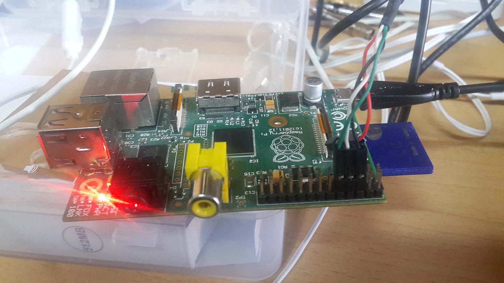

注意，在Mac OS 10.11下需要下载最新版的驱动，链接

[PL2303\_For\_MacOS\_10.11](http://www.prolific.com.tw/UserFiles/files/PL2303_MacOSX_1_6_0_20151022.zip)

####通过Linux获得硬件数据，截屏给出获得的硬件数据，如CPU型号、时钟频率、内存大小等，执行命令

	# cat /proc/cpuinfo

CPU型号输出信息如下：

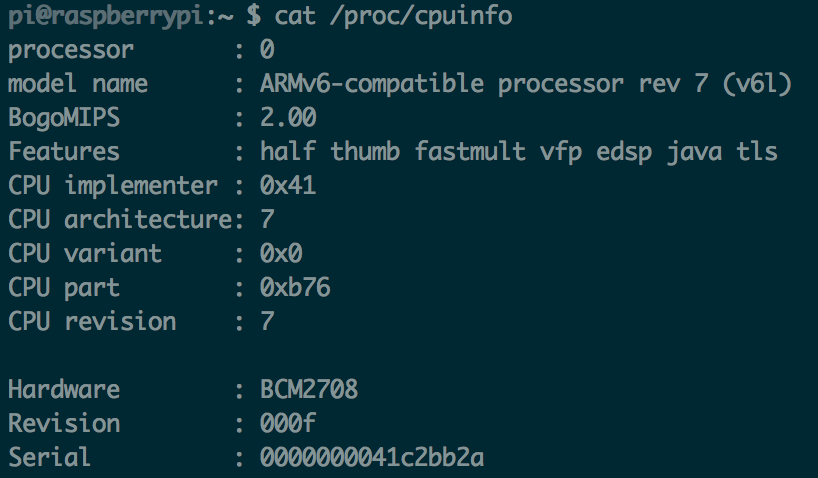

	# cat /proc/meminfo

时钟频率：

	# cat /sys/devices/system/cpu/cpu0/cpufreq/scaling_cur_freq

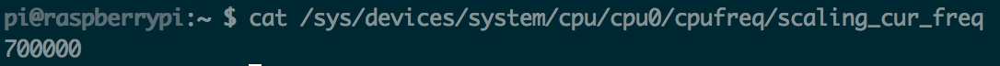

内存大小信息如下：

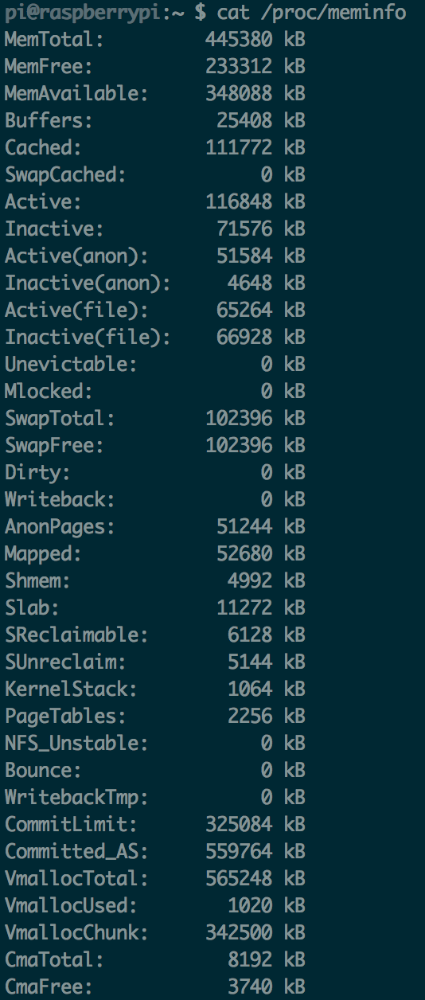
	


####网络配置参数，Rpi和PC两端网络连接

打开路由器后台界面，我们查看连接设备

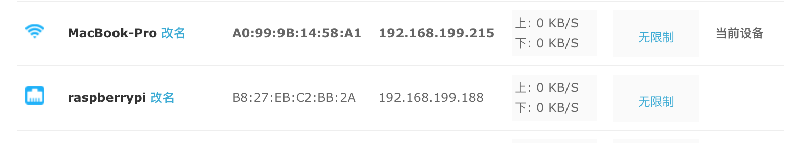

MacBook-Pro是PC端，raspberrypi是树莓派板卡端，两设备的ip均可得到。

我们先证明两台设备都可以连接外网(ping通百度网址)：

	# ping www.baidu.com

MacBook:

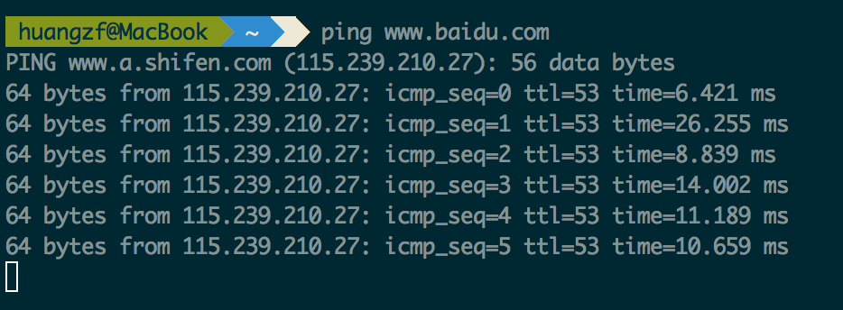

Raspberrypi:

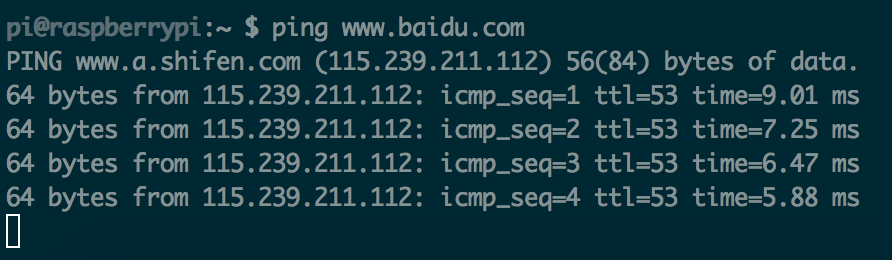

然后实施两机互ping：

PC ping树莓派：

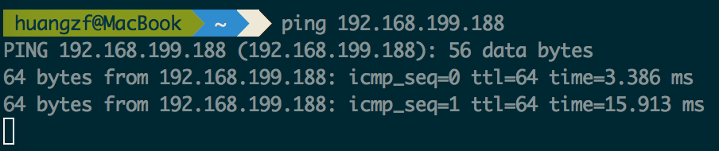

树莓派ping PC：

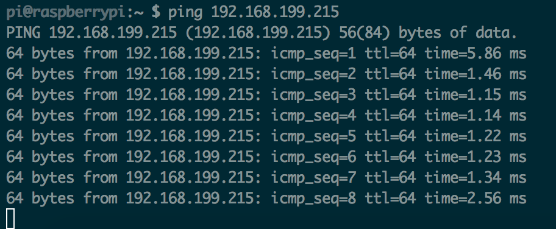

在路由上查看发现Rpi的ip地址为192.168.1.100，于是ssh连接之：

	# ssh pi@192.168.1.100

password输入：

	password: raspberry

连接后结果如下：

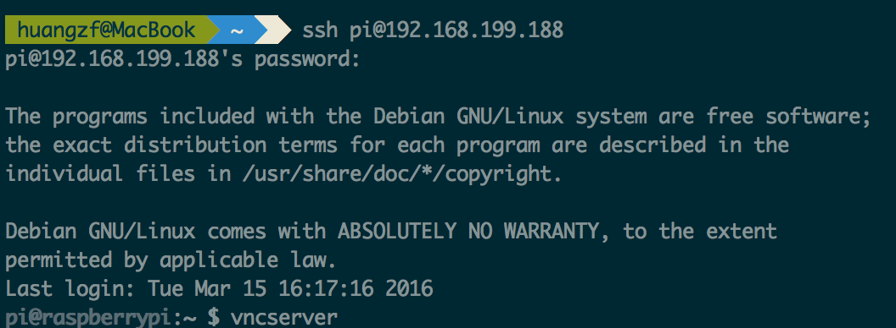


####多个登陆看到不同端口的登陆，用write命令通信

执行w命令，可查看不同用户不同端口的登录，结果如下：

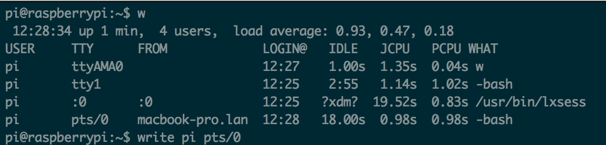

可以清楚地看到有一台MacBook连接了树莓派，我们同时用ssh和串口访问树莓派，在串口连接的终端上使用write命令：
	# write pi pts/0

在终端可以发送字符信息，此时ssh连接Rpi的终端可以显示我发送的内容。

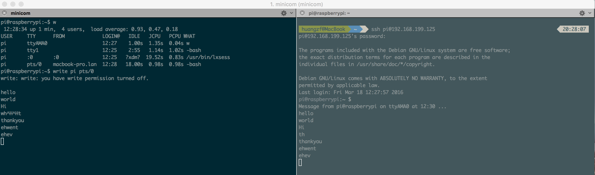



####Rpi上的SAMBA配置文件

配置文件位于目录`/etc/samba/smb.conf`, 内容如下：

	#
	# Sample configuration file for the Samba suite for Debian GNU/Linux.
	#
	#
	# This is the main Samba configuration file. You should read the
	# smb.conf(5) manual page in order to understand the options listed
	# here. Samba has a huge number of configurable options most of which
	# are not shown in this example
	#
	# Some options that are often worth tuning have been included as
	# commented-out examples in this file.
	#  - When such options are commented with ";", the proposed setting
	#    differs from the default Samba behaviour
	#  - When commented with "#", the proposed setting is the default
	#    behaviour of Samba but the option is considered important
	#    enough to be mentioned here
	#
	# NOTE: Whenever you modify this file you should run the command
	# "testparm" to check that you have not made any basic syntactic
	# errors.
	
	#======================= Global Settings =======================
	
	[global]
	
	security=share //用于登陆域，或用户验证登陆，安全等级
	
	## Browsing/Identification ###
	
	# Change this to the workgroup/NT-domain name your Samba server will part of
	   workgroup = WORKGROUP
	
	# Windows Internet Name Serving Support Section:
	# WINS Support - Tells the NMBD component of Samba to enable its WINS Server
	#   wins support = no //设置本地为wins服务器
	
	# WINS Server - Tells the NMBD components of Samba to be a WINS Client
	# Note: Samba can be either a WINS Server, or a WINS Client, but NOT both
	;   wins server = w.x.y.z # 指定wins服务器的网络地址
	
	# This will prevent nmbd to search for NetBIOS names through DNS.
	   dns proxy = no  //当wins服务器在wins中找不到名字的话，就会查找dns
	
	#### Networking ####
	
	# The specific set of interfaces / networks to bind to
	# This can be either the interface name or an IP address/netmask;
	# interface names are normally preferred
	;   interfaces = 127.0.0.0/8 eth0 //设置samba将对哪些网络接口进行服务
	
	# Only bind to the named interfaces and/or networks; you must use the
	# 'interfaces' option above to use this.
	# It is recommended that you enable this feature if your Samba machine is
	# not protected by a firewall or is a firewall itself.  However, this
	# option cannot handle dynamic or non-broadcast interfaces correctly.
	;   bind interfaces only = yes //samba只对这几个网络接口服务
	
	
	
	#### Debugging/Accounting ####
	
	# This tells Samba to use a separate log file for each machine
	# that connects
	   log file = /var/log/samba/log.%m #日志文件
	
	# Cap the size of the individual log files (in KiB).
	   max log size = 1000 #日志文件的大小
	
	# If you want Samba to only log through syslog then set the following
	# parameter to 'yes'.
	#   syslog only = no	#只使用系统日志，关闭samba日志
	
	# We want Samba to log a minimum amount of information to syslog. Everything
	# should go to /var/log/samba/log.{smbd,nmbd} instead. If you want to log
	# through syslog you should set the following parameter to something higher.
	   syslog = 0		# syslog的日志级(0,err)(1,warning)(2,notice)(3,ifno)(4或以上，debug)
	
	# Do something sensible when Samba crashes: mail the admin a backtrace
	   panic action = /usr/share/samba/panic-action %d
	
	
	####### Authentication #######
	
	# Server role. Defines in which mode Samba will operate. Possible
	# values are "standalone server", "member server", "classic primary
	# domain controller", "classic backup domain controller", "active
	# directory domain controller".
	#
	# Most people will want "standalone sever" or "member server".
	# Running as "active directory domain controller" will require first
	# running "samba-tool domain provision" to wipe databases and create a
	# new domain.
	   server role = standalone server
	
	# If you are using encrypted passwords, Samba will need to know what
	# password database type you are using.
	   passdb backend = tdbsam
	
	   obey pam restrictions = yes //当encrypt passwords = yes 时，samba 会忽略pam的验证，因为pam不支持(挑战/回答)验证机制，他只用来做平文密码的验证
	
	# This boolean parameter controls whether Samba attempts to sync the Unix
	# password with the SMB password when the encrypted SMB password in the
	# passdb is changed.
	   unix password sync = yes //当用户改变samba加密的密码时,SAMBA会试着更新UNIX用户密码
	
	# For Unix password sync to work on a Debian GNU/Linux system, the following
	# parameters must be set (thanks to Ian Kahan <<kahan@informatik.tu-muenchen.de> for
	# sending the correct chat script for the passwd program in Debian Sarge).
	   passwd program = /usr/bin/passwd %u //这个就指定更改密码的命令
	   passwd chat = *Enter\snew\s*\spassword:* %n\n *Retype\snew\s*\spassword:* %n\n *password\supdated\ssuccessfully* .
	
	# This boolean controls whether PAM will be used for password changes
	# when requested by an SMB client instead of the program listed in
	# 'passwd program'. The default is 'no'.
	   pam password change = yes
	
	# This option controls how unsuccessful authentication attempts are mapped
	# to anonymous connections
	   map to guest = bad user
	
	########## Domains ###########
	
	#
	# The following settings only takes effect if 'server role = primary
	# classic domain controller', 'server role = backup domain controller'
	# or 'domain logons' is set
	#
	
	# It specifies the location of the user's
	# profile directory from the client point of view) The following
	# required a [profiles] share to be setup on the samba server (see
	# below)
	;   logon path = \\%N\profiles\%U
	# Another common choice is storing the profile in the user's home directory
	# (this is Samba's default)
	#   logon path = \\%N\%U\profile
	
	# The following setting only takes effect if 'domain logons' is set
	# It specifies the location of a user's home directory (from the client
	# point of view)
	;   logon drive = H:
	#   logon home = \\%N\%U
	
	# The following setting only takes effect if 'domain logons' is set
	# It specifies the script to run during logon. The script must be stored
	# in the [netlogon] share
	# NOTE: Must be store in 'DOS' file format convention
	;   logon script = logon.cmd
	
	# This allows Unix users to be created on the domain controller via the SAMR
	# RPC pipe.  The example command creates a user account with a disabled Unix
	# password; please adapt to your needs
	; add user script = /usr/sbin/adduser --quiet --disabled-password --gecos "" %u
	
	# This allows machine accounts to be created on the domain controller via the
	# SAMR RPC pipe.
	# The following assumes a "machines" group exists on the system
	; add machine script  = /usr/sbin/useradd -g machines -c "%u machine account" -d /var/lib/samba -s /bin/false %u
	
	# This allows Unix groups to be created on the domain controller via the SAMR
	# RPC pipe.
	; add group script = /usr/sbin/addgroup --force-badname %g
	
	############ Misc ############
	
	# Using the following line enables you to customise your configuration
	# on a per machine basis. The %m gets replaced with the netbios name
	# of the machine that is connecting
	;   include = /home/samba/etc/smb.conf.%m
	
	# Some defaults for winbind (make sure you're not using the ranges
	# for something else.)
	;   idmap uid = 10000-20000
	;   idmap gid = 10000-20000
	;   template shell = /bin/bash
	
	# Setup usershare options to enable non-root users to share folders
	# with the net usershare command.
	
	# Maximum number of usershare. 0 (default) means that usershare is disabled.
	;   usershare max shares = 100 
	
	# Allow users who've been granted usershare privileges to create
	# public shares, not just authenticated ones
	   usershare allow guests = yes
	
	#======================= Share Definitions =======================
	
	[homes]
	   comment = Home Directories
	   browseable = no
	
	# By default, the home directories are exported read-only. Change the
	# next parameter to 'no' if you want to be able to write to them.
	   read only = yes
	
	# File creation mask is set to 0700 for security reasons. If you want to
	# create files with group=rw permissions, set next parameter to 0775.
	   create mask = 0700
	
	# Directory creation mask is set to 0700 for security reasons. If you want to
	# create dirs. with group=rw permissions, set next parameter to 0775.
	   directory mask = 0700
	
	# By default, \\server\username shares can be connected to by anyone
	# with access to the samba server.
	# The following parameter makes sure that only "username" can connect
	# to \\server\username
	# This might need tweaking when using external authentication schemes
	   valid users = %S 	//可登陆用户
	
	# Un-comment the following and create the netlogon directory for Domain Logons
	# (you need to configure Samba to act as a domain controller too.)
	;[netlogon]
	;   comment = Network Logon Service
	;   path = /home/samba/netlogon
	;   guest ok = yes
	;   read only = yes
	
	# Un-comment the following and create the profiles directory to store
	# users profiles (see the "logon path" option above)
	# (you need to configure Samba to act as a domain controller too.)
	# The path below should be writable by all users so that their
	# profile directory may be created the first time they log on
	;[profiles]
	;   comment = Users profiles
	;   path = /home/samba/profiles
	;   guest ok = no
	;   browseable = no
	;   create mask = 0600
	;   directory mask = 0700
	
	[printers]
	   comment = All Printers
	   browseable = no
	   path = /var/spool/samba
	   printable = yes
	   guest ok = no
	   read only = yes
	   create mask = 0700
	
	# Windows clients look for this share name as a source of downloadable
	# printer drivers
	[print$]
	   comment = Printer Drivers
	   path = /var/lib/samba/printers
	   browseable = yes 
	   read only = yes
	   guest ok = no
	# Uncomment to allow remote administration of Windows print drivers.
	# You may need to replace 'lpadmin' with the name of the group your
	# admin users are members of.
	# Please note that you also need to set appropriate Unix permissions
	# to the drivers directory for these users to have write rights in it
	;   write list = root, @lpadmin
	
	[share]
	comment = share all //权限为完全共享
	path = /home/samba  
	browseable = yes
	public = yes
	writable = no



####用各种方式传递文件

* 通过SAMBA共享；

在PC Mac上 System Preference->Sharing->File Sharing

看到共享文件夹名为samba，在主目录下。

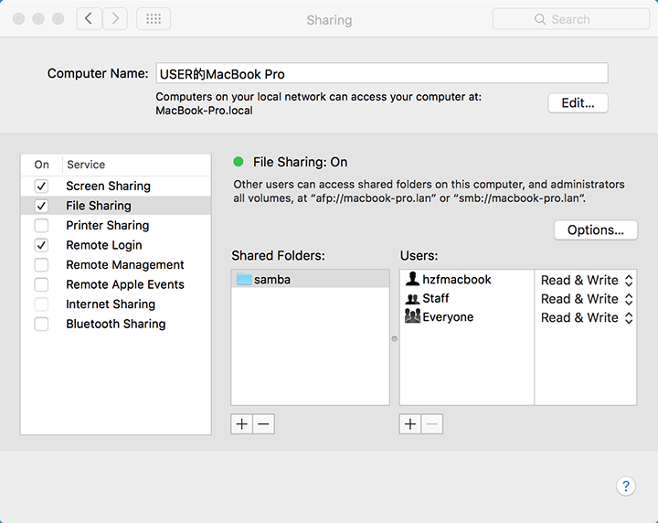

然后在System Preference->Users & Groups->Guest User下，在Allow guest users to connect to shared folders

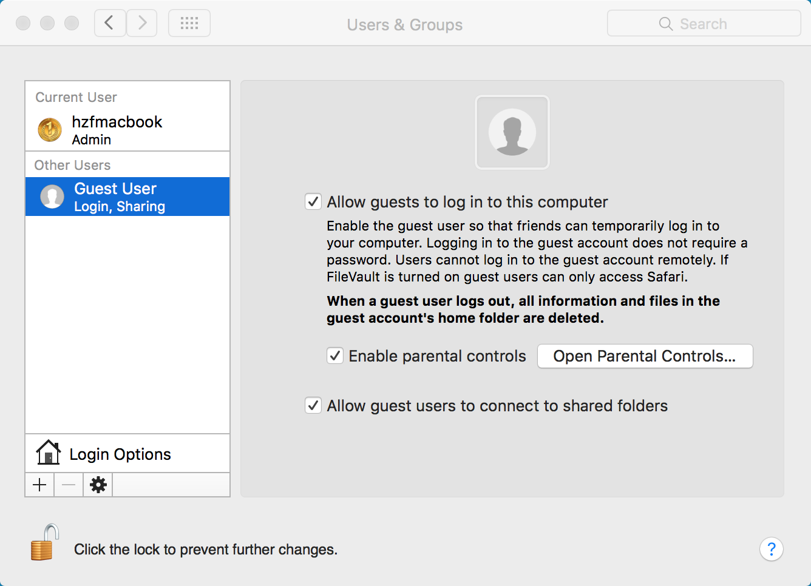

在树莓派上用Guest用户登录PC，执行smbclient连接，结果如下：

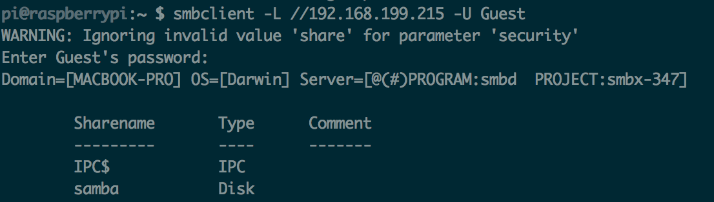

此时smb连接已经成功，再使用mount命令挂载到/mnt目录下：(samba目录下原有Main.java文件)

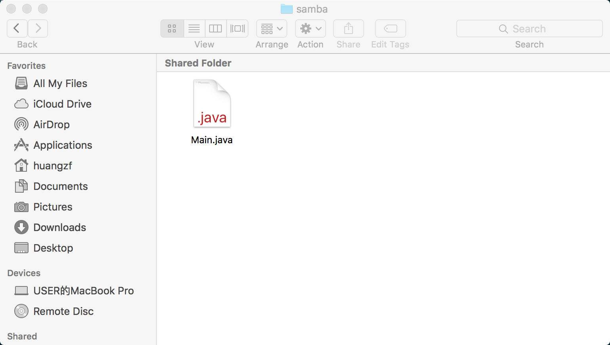

在/mnt目录下查看，发现Main.java文件，故挂载成功，samba共享完成。

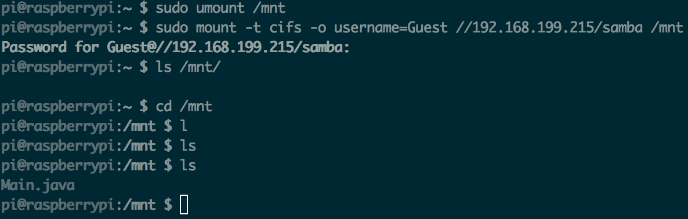



*	通过sftp传递；

在树莓派上配置`/etc/ssh/ssh_config`

在`/etc/ssh/ssh_config`的末尾添加

	Subsystem sftp internal-sftp 
	Match Group sftp 
	ChrootDirectory /home/samba 
	ForceCommand internal-sftp 
	AllowTcpForwarding no 
	X11Forwarding no

在PC上用`sftp`命令连接树莓派，结果如下：

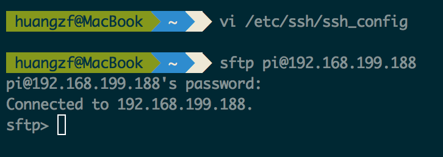

以下我们分别用`get`和`put`命令，从板卡的主目录下载`Main.java`，将PC主目录下的`main.c`上传到板卡主目录下。

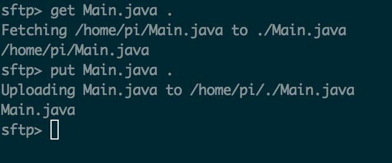

*	通过串口XModem协议传递；

下载SecureCRT for Mac，串口连接到Rpi后，在板上输入`rx filename`命令，使其处于等待接收文件状态：

	# rx main.c

PC端打开SecureCRT for Mac，Transfer->Send Xmodem

选择main.c文件，点击OK

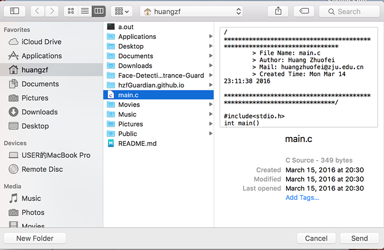

然后观察板上terminal，发现文件已成功接收。

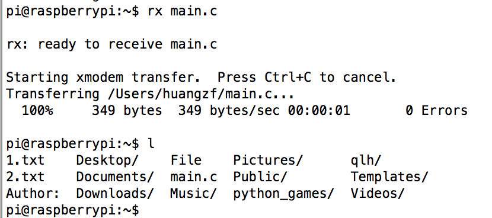


####给出你所选择的交叉编译环境的情况：来源、安装过程等；

树莓派下载`arm-linux-gnueabi`工具链，ubuntu 14.04下：

	# sudo apt-get install arm-linux-gnueabi

交叉编译程序main.c，并证明它是ARM的可执行文件。

在ubuntu的主目录下编写main.c的Hello World程序，执行

	# arm-linux-gnueabi-gcc main.c

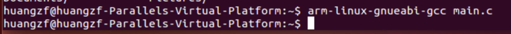

生成a.out文件后，在Rpi上用scp将可执行文件下载到板子的当前目录下

	# scp huangzf@macbook-pro.lan:~/a.out .

然后运行文件，显示`Hello World!`，说明运行成功，即该交叉编译的产物是ARM的可执行文件。

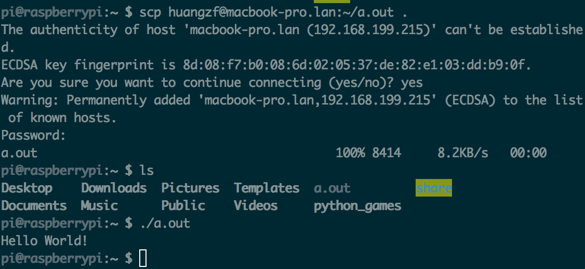



####VNC远程访问图形桌面

这里使用vnc连接方式，在PC端配置VNC Viewer，RPi上配置VNC Server。

VNC Server: 在RPi上命令行执行：

	# sudo apt-get install vncserver
在RPi上初始化vncserver:

	# vncserver
	
此时需要设置密码: 123456，弹出如下信息，该信息告诉我们用vncviewer连接Rpi时，要使用1号端口

	New 'raspberrypi:7 (pi)' desktop is raspberrypi:7

	Starting applications specified in /home/pi/.vnc/xstartup
	Log file is /home/pi/.vnc/raspberrypi:7.log

VNC Viewer: [https://www.realvnc.com/download/viewer/](https://www.realvnc.com/download/viewer/)

开启后界面如下，在VNC Server栏输入

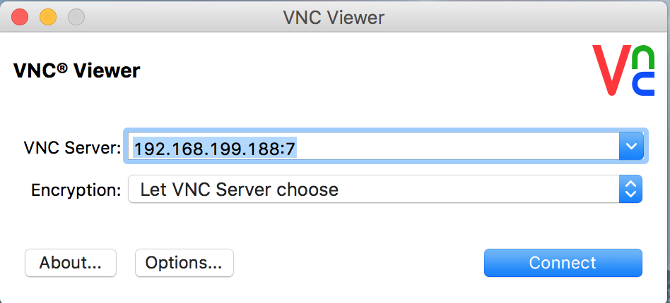

点击connect，连接后结果截图(在图形桌面中右键启动terminal)：

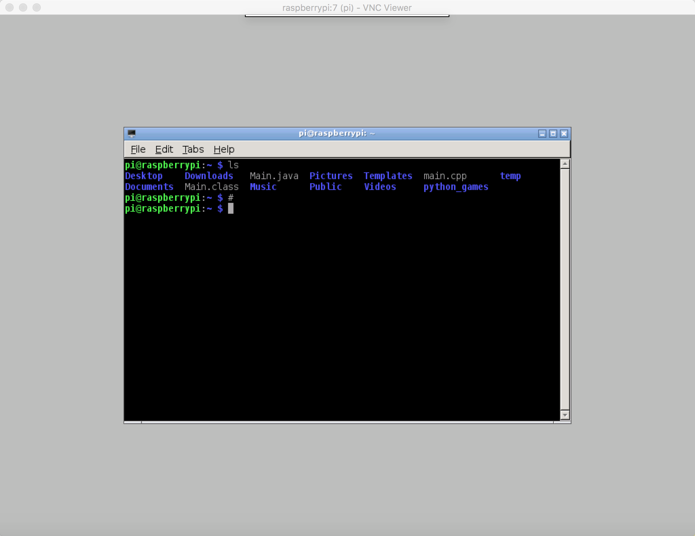

此时远程图形桌面连接成功。

### 交叉编译含STL库的C++程序

本机上安装交叉编译的g++工具：

	# sudo apt-get install g++-arm-linux-gnueabi

编译main.cpp文件：

	# arm-linux-gnueabi-g++ main.cpp

得到a.out文件用scp命令传输到树莓派上：

	# scp a.out pi@192.168.199.125

运行结果如下：(图中含有main.cpp的文件内容，内使用vector)

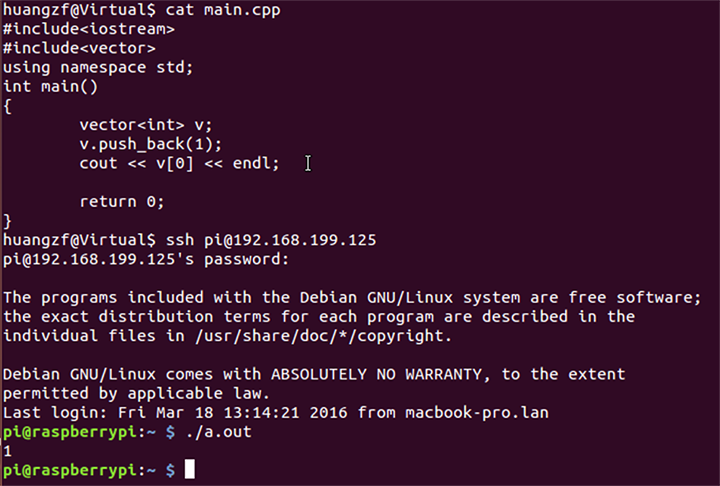
