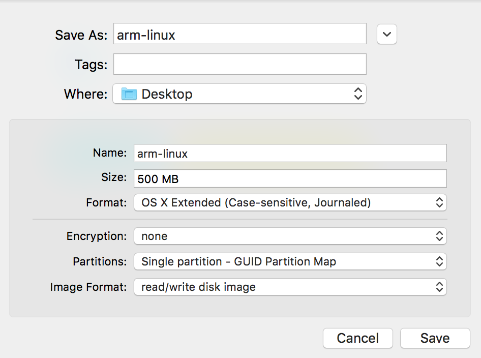
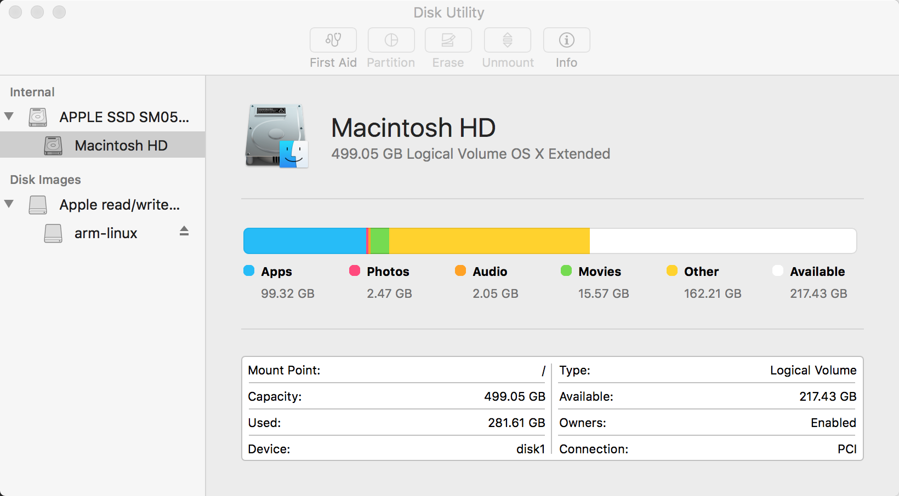
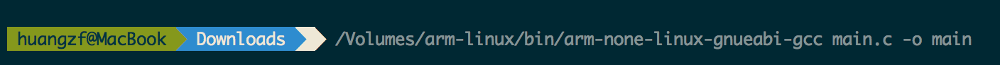

<link rel="stylesheet" type="../text/css" href="../stylesheets/stylesheet.css" media="screen">
    <link rel="stylesheet" type="../text/css" href="../stylesheets/github-dark.css" media="screen">

##Mac OS上配置Raspberry Pi的ARM交叉编译环境

###1. 下载编译工具链

[ARMx-2009q3-67.tar.bz2](http://pan.baidu.com/s/1dECeDY5)

###2. 新建一个磁盘映像

打开 Disk Utility -> File -> New Image -> Blank Image，按照下图进行参数配置

###3. 解压工具链到磁盘映像

进入到`ARMx-2009q3-67.tar.bz2`文件所在目录，执行`tar`解压命令：

	tar -zx -C /Volumes/arm-linux/ --strip-components 1 -f ARMx-2009q3-67.tar.bz2

解压完成后，在当前目录创建`main.c`文件，然后执行编译命令：

	/Volumes/arm-linux/bin/arm-none-linux-gnueabi-gcc main.c -o main

编译完成后上传到树莓派即可运行。

---

Original Reference:

[http://blog.csdn.net/rk2900/article/details/8738442](http://blog.csdn.net/rk2900/article/details/8738442)