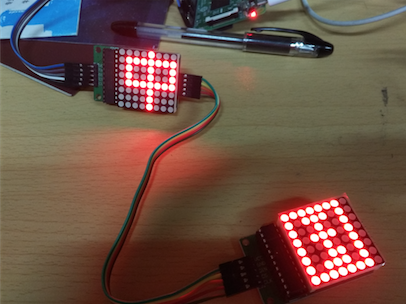
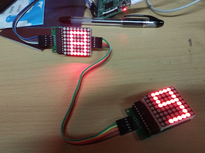
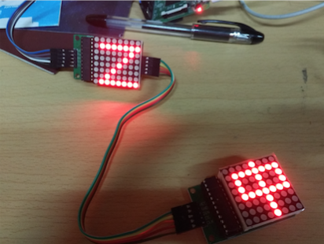
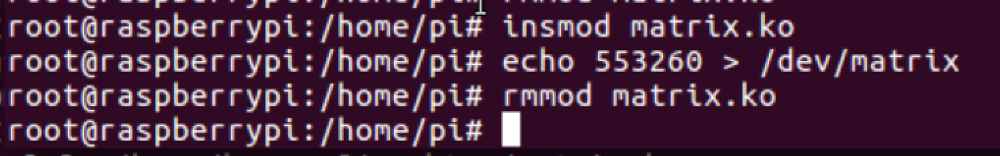
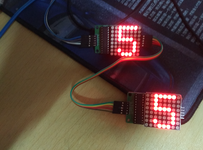
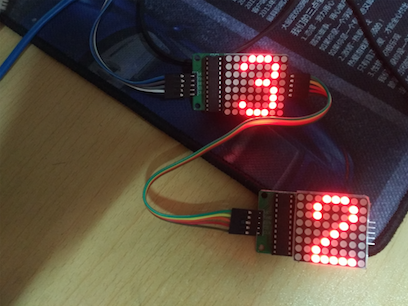
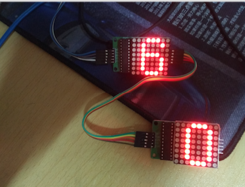

###1. 设计方案，画连线示意图

我们需要设计树莓派板卡与两块串联的`MAX2719`相连的方案，树莓派需要提供3个`GPIO`接口。接线方案如下（**由于Fritzing元件库找不到这个元件，这里用表格列举代替，实物连接图在稍后部分的结果展示图片中可见**）：

树莓派和第一块`MAX2719`的连接：

|   树莓派引脚 | MAX2719 |
| -----------|:------:|
|   5V       |    VCC |
|   GND      |    GND |
|   GPIO.7      |    DIN |
|   GPIO.2      |    CS |
|   GPIO.3      |    CLK | 

第一块`MAX2719`和第二块`MAX2719`的连接：

|   MAX2719_1 | MAX2719_2 |
| -----------|:------:|
|   VCC       |    VCC |
|   GND      |    GND |
|   DOUT      |    DIN |
|   CS      |    CS |
|   CLK      |    CLK | 


---


###2. 编写C/C++程序，采用Arduino-ish库或虚拟文件系统访问GPIO，实现在矩阵上显示文字或图案

首先，树莓派上我们最常用的C/C++库是`wiringPi`，其下载链接为：

[https://github.com/WiringPi/WiringPi](https://github.com/WiringPi/WiringPi)

clone到本地后，进入目录，执行：`./build` 即可安装使用。随后可以在C/C++程序中通过引入`#include<wiringPi.h>`头文件调用GPIO相关的控制函数。gcc编译C文件时加入`-lwiringPi`参数将库链接进来即可。

根据实验要求，我们需要点亮两个串联的`MAX2719`驱动LED矩阵。


* 写入流程

 &nbsp;&nbsp;&nbsp;&nbsp;&nbsp;&nbsp;&nbsp;&nbsp;首先CS引脚置0，表示允许写入。而后从高位顺序写入16个bit。每个bit的写入方式为首先DIN置为要写入的bit值，而后CLK产生一个下降沿即被读入。最后CS引脚置1表示写入结束。

* 显示图案

 &nbsp;&nbsp;&nbsp;&nbsp;&nbsp;&nbsp;&nbsp;&nbsp;在运行之前，需要进行一次初始化，其行为是向某几个特定的地址写入特定的值。至少需要写入两个地址，第一个是0x0b，写入0x07表示扫描显示所有行。第二个是0x0c，写入1表示进入工作模式。
 
 &nbsp;&nbsp;&nbsp;&nbsp;&nbsp;&nbsp;&nbsp;&nbsp;而后点阵上每一行都有其地址，如第一行是0x01到第八行是0x08，每次向固定行的地址写入一个8位二进制数即可在指定行上显示图案。

以上就是点亮单个`MAX2719`驱动的LED矩阵的基本原理，参考51单片机的程序，我们可以比较容易地改编成wiringPi的C++程序。**但我们若想点亮两个串联的LED矩阵，需要作出以下两点改变：**

* 将两块元件的`DIN`和`DOUT`相接，其余接口依次对位相接。

* 向MAX7219写入数据的函数改成接收两个地址和两个数据参数，用上述同样的方式先点亮第一个LED矩阵，然后根据器件手册中**第16.5个时钟周期，数据从第一片MAX7219的DOUT端开始输出**这一特性，我们随后将时钟CLK置高电平，然后对第一片MAX7219进行清空操作。

```
void Write_Max7219(uchar addr1,uchar dat1, uchar addr2, uchar dat2)
{ 
  digitalWrite(CS, LOW);
  Write_Max7219_byte(address);           //写入地址，即数码管编号
  Write_Max7219_byte(dat);               //写入数据，即数码管显示数字 
  digitalWrite(CS, HIGH);

  digitalWrite(CLK, HIGH);              // 第16.5个时钟周期，数据从第一片MAX7219的DOUT端开始输出

  digitalWrite(CS, LOW);
  Write_Max7219_byte(0x00);           //对第一片MAX7219进行空操作
  Write_Max7219_byte(0x00);               
  digitalWrite(CS, HIGH);

}
```

最后，我们根据disp1表格，每次依次点亮两个相邻的字符，两次点亮之间间隔1s。代码如下：

```
#include <wiringPi.h>		//头文件

#define uchar unsigned char
#define uint  unsigned int

int CLK = 3; //GPIO3
int CS = 2;  //GPIO2
int DIN = 7; //GPIO7

uchar disp1[38][8]={
{0x3C,0x42,0x42,0x42,0x42,0x42,0x42,0x3C},//0
{0x10,0x18,0x14,0x10,0x10,0x10,0x10,0x10},//1
{0x7E,0x2,0x2,0x7E,0x40,0x40,0x40,0x7E},//2
{0x3E,0x2,0x2,0x3E,0x2,0x2,0x3E,0x0},//3
{0x8,0x18,0x28,0x48,0xFE,0x8,0x8,0x8},//4
{0x3C,0x20,0x20,0x3C,0x4,0x4,0x3C,0x0},//5
{0x3C,0x20,0x20,0x3C,0x24,0x24,0x3C,0x0},//6
{0x3E,0x22,0x4,0x8,0x8,0x8,0x8,0x8},//7
{0x0,0x3E,0x22,0x22,0x3E,0x22,0x22,0x3E},//8
{0x3E,0x22,0x22,0x3E,0x2,0x2,0x2,0x3E},//9
{0x8,0x14,0x22,0x3E,0x22,0x22,0x22,0x22},//A
{0x3C,0x22,0x22,0x3E,0x22,0x22,0x3C,0x0},//B
{0x3C,0x40,0x40,0x40,0x40,0x40,0x3C,0x0},//C
{0x7C,0x42,0x42,0x42,0x42,0x42,0x7C,0x0},//D
{0x7C,0x40,0x40,0x7C,0x40,0x40,0x40,0x7C},//E
{0x7C,0x40,0x40,0x7C,0x40,0x40,0x40,0x40},//F
{0x3C,0x40,0x40,0x40,0x40,0x44,0x44,0x3C},//G
{0x44,0x44,0x44,0x7C,0x44,0x44,0x44,0x44},//H
{0x7C,0x10,0x10,0x10,0x10,0x10,0x10,0x7C},//I
{0x3C,0x8,0x8,0x8,0x8,0x8,0x48,0x30},//J
{0x0,0x24,0x28,0x30,0x20,0x30,0x28,0x24},//K
{0x40,0x40,0x40,0x40,0x40,0x40,0x40,0x7C},//L
{0x81,0xC3,0xA5,0x99,0x81,0x81,0x81,0x81},//M
{0x0,0x42,0x62,0x52,0x4A,0x46,0x42,0x0},//N
{0x3C,0x42,0x42,0x42,0x42,0x42,0x42,0x3C},//O
{0x3C,0x22,0x22,0x22,0x3C,0x20,0x20,0x20},//P
{0x1C,0x22,0x22,0x22,0x22,0x26,0x22,0x1D},//Q
{0x3C,0x22,0x22,0x22,0x3C,0x24,0x22,0x21},//R
{0x0,0x1E,0x20,0x20,0x3E,0x2,0x2,0x3C},//S
{0x0,0x3E,0x8,0x8,0x8,0x8,0x8,0x8},//T
{0x42,0x42,0x42,0x42,0x42,0x42,0x22,0x1C},//U
{0x42,0x42,0x42,0x42,0x42,0x42,0x24,0x18},//V
{0x0,0x49,0x49,0x49,0x49,0x2A,0x1C,0x0},//W
{0x0,0x41,0x22,0x14,0x8,0x14,0x22,0x41},//X
{0x41,0x22,0x14,0x8,0x8,0x8,0x8,0x8},//Y
{0x0,0x7F,0x2,0x4,0x8,0x10,0x20,0x7F},//Z
{0x8,0x7F,0x49,0x49,0x7F,0x8,0x8,0x8},//中
{0xFE,0xBA,0x92,0xBA,0x92,0x9A,0xBA,0xFE},//国
};

//--------------------------------------------
//功能：向MAX7219(U3)写入字节
//入口参数：DATA 
//出口参数：无
//说明：
void Write_Max7219_byte(uchar DATA)         
{
  uchar i;    
  digitalWrite(CS,LOW);  
  for(i = 8; i >= 1; i--)
  {     
    digitalWrite(CLK, LOW);
    //Max7219_pinDIN = DATA & 0x80;
    if(DATA & 0x80)
      digitalWrite(DIN,HIGH);
    else
      digitalWrite(DIN,LOW);
    DATA = DATA << 1;
    digitalWrite(CLK, HIGH);
  }                                 
}
//-------------------------------------------
//功能：向MAX7219写入数据
//入口参数：addr1、dat1、addr2、dat2
//出口参数：无
//说明：
void Write_Max7219(uchar address, uchar dat)
{ 
  digitalWrite(CS, LOW);
  Write_Max7219_byte(address);           //写入地址，即数码管编号
  Write_Max7219_byte(dat);               //写入数据，即数码管显示数字 
  digitalWrite(CS, HIGH);
}

void Write_Max7219_Two(uchar addr1,uchar dat1, uchar addr2, uchar dat2)
{ 
  Write_Max7219(addr1, dat1);
  
  digitalWrite(CS, LOW);
  Write_Max7219_byte(addr2);           //写入地址，即数码管编号
  Write_Max7219_byte(dat2);               //写入数据，即数码管显示数字 

  digitalWrite(CLK, HIGH);              // 第16.5个时钟周期，数据从第一片MAX7219的DOUT端开始输出

  Write_Max7219_byte(0x00);           //对第一片MAX7219进行空操作
  Write_Max7219_byte(0x00);               
  digitalWrite(CS, HIGH);

}

void Init_MAX7219(void)
{
  Write_Max7219(0x09, 0x00);       //译码方式：BCD码
  Write_Max7219(0x0a, 0x03);       //亮度 
  Write_Max7219(0x0b, 0x07);       //扫描界限；8个数码管显示
  Write_Max7219(0x0c, 0x01);       //掉电模式：0，普通模式：1
  Write_Max7219(0x0f, 0x00);       //显示测试：1；测试结束，正常显示：0
}


int main()
{
    wiringPiSetup();	//wiringPi的初始化
    
    pinMode(CLK, OUTPUT);	//引脚置成输出状态
    pinMode(CS, OUTPUT);
    pinMode(DIN, OUTPUT);

    uchar i, j;
    delay(50);
    Init_MAX7219();
    while (1) {
      for(j=0;j<37;j++)
      {
        for(i=1;i<9;i++)
          Write_Max7219_Two(i, disp1[j][i-1], i, disp1[j+1][i-1]);//同时显示两个相邻的字符
        delay(1000);
      }  
    }
}
```

编译：

	gcc main.c -lwiringPi

运行需要root权限：

	sudo ./a.out

效果如下：





每次依次点亮两个相邻的字符顺利实现。

###3. 编写字符设备驱动程序，直接访问GPIO控制寄存器，能将write()送来的单个字符在矩阵上显示出来

首先要编译内核模块，该模块在加载到系统内部时，会申请在/dev目录下生成一个matrix文件。使用的时候直接向其输出想要在点阵上显示的字符，写入的时候会触发模块中的matrix_write函数。我们每次从缓冲区获取两个字符内容，在级联的LED上同时显示。

```
#include <linux/init.h>
#include <linux/kernel.h>
#include <linux/module.h>
#include <linux/moduleparam.h>
#include <linux/fs.h>
#include <linux/miscdevice.h>
#include <linux/string.h>
#include <linux/delay.h>
#include <linux/gpio.h>
#include <linux/workqueue.h>

MODULE_LICENSE("GPL");
MODULE_AUTHOR("huangzf <huangzhuofei@zju.edu.cn>");
MODULE_DESCRIPTION("A 2-cascade max2719");

//查看GPIO引脚图对应的BCM编码
#define DIN 4		//GPIO.7
#define CS 27		//GPIO.2
#define CLK 22	//GPIO.3

void write_byte(unsigned char b){
    unsigned char i, tmp;
    for (i=0; i<8; i++){
        tmp = (b & 0x80) > 0;
        b <<= 1;
        gpio_set_value(DIN, tmp);
        gpio_set_value(CLK, 1);
        gpio_set_value(CLK, 0);
    }
}

void write_word(unsigned char addr, unsigned char num){
    gpio_set_value(CS, 0);
    write_byte(addr);
    write_byte(num);
    gpio_set_value(CS, 1);
    
}

//向级联的两个MAX2719写入两个字符
void write_dword(unsigned char addr1, unsigned char num1, unsigned char addr2, unsigned char num2){
    
    write_word(addr1, num1);

    gpio_set_value(CS, 0);
    write_byte(addr2);
    write_byte(num2);

    gpio_set_value(CLK, 1);

    write_byte(0x00);
    write_byte(0x00);
    gpio_set_value(CS, 1);
}

//显示两个字符
void Matrix_render(unsigned char* tmp, unsigned char* tmp2){
    int i;
    for (i=0; i<8; i++){
        write_dword(i+1, tmp[i], i+1, tmp2[i]);
    }
}

//与上述wiringPi的GPIO编码表有区别，混用可能会有问题
unsigned char digits[][8]={
    {0x1c, 0x22, 0x22, 0x22, 0x22, 0x22, 0x22, 0x1c}, // 0
    {0x08, 0x18, 0x08, 0x08, 0x08, 0x08, 0x08, 0x1c}, // 1
    {0x1c, 0x22, 0x22, 0x04, 0x08, 0x10, 0x20, 0x3e}, // 2
    {0x1c, 0x22, 0x02, 0x0c, 0x02, 0x02, 0x22, 0x1c}, // 3
    {0x04, 0x0c, 0x14, 0x14, 0x24, 0x1e, 0x04, 0x04}, // 4
    {0x3e, 0x20, 0x20, 0x3c, 0x02, 0x02, 0x22, 0x1c}, // 5
    {0x1c, 0x22, 0x20, 0x3c, 0x22, 0x22, 0x22, 0x1c}, // 6
    {0x3e, 0x24, 0x04, 0x08, 0x08, 0x08, 0x08, 0x08}, // 7
    {0x1c, 0x22, 0x22, 0x1c, 0x22, 0x22, 0x22, 0x1c}, // 8
    {0x1c, 0x22, 0x22, 0x22, 0x1e, 0x02, 0x22, 0x1c}, // 9
};


void Matrix_init(void){
    write_word(0x09, 0x00);
    write_word(0x0a, 0x03);
    write_word(0x0b, 0x07);
    write_word(0x0c, 0x01);

    Matrix_render(digits[0], digits[0]);
}

#define BUFFERSIZE 128
#define DELAYTIME 1
unsigned char disp[BUFFERSIZE];
int head = 0, tail = 0;
static struct timer_list timer;

void Matrix_next_display(unsigned long);

void ptr_inc(int *ptr){
    *ptr = (*ptr + 1) % BUFFERSIZE;
}

static void timer_register(struct timer_list* ptimer){
    init_timer(ptimer);
    ptimer->data = DELAYTIME;
    ptimer->expires = jiffies + (DELAYTIME * HZ / 2);
    ptimer->function = Matrix_next_display;
    add_timer(ptimer);
}

void disp_start(void)
{
    timer_register(&timer);
}

void Matrix_next_display(unsigned long data)
{
    if (head != tail){
        unsigned char *ptr = digits[0];
		unsigned char *ptr2 = digits[0];
		//从缓冲区获取第一个字符
        unsigned char c = disp[head];
        if ('0' <= c && c <= '9'){
            ptr = digits[c - '0'];
        }
        //从缓冲区获取第二个字符
		if (head + 1 != tail){
		    c = disp[head + 1];
		    if ('0' <= c && c <= '9')
		    	ptr2 = digits[c - '0'];
		}
        Matrix_render(ptr, ptr2);
        ptr_inc(&head);
        disp_start();
    }else{
        Matrix_render(digits[0], digits[0]);
    }
}

static int matrix_write(struct file *file, const char __user *buffer,
        size_t count, loff_t *ppos){
    int i;
    if (head == tail && count > 0){
        disp_start();
    }
    for (i=0; i<count; i++){
        ptr_inc(&tail);
        if (tail == head)
            ptr_inc(&head);
        disp[tail] = buffer[i];
    }
    return count;
}

static struct file_operations matrix_fops = {
    .owner = THIS_MODULE,
    .write = matrix_write,
    .llseek = noop_llseek
};

static struct miscdevice matrix_misc_device = {
    .minor = MISC_DYNAMIC_MINOR,
    .name = "matrix",
    .fops = &matrix_fops
};

static int __init matrix_init(void){
    if (!gpio_is_valid(DIN) || !gpio_is_valid(CLK) || !gpio_is_valid(CS)){
        printk(KERN_INFO "GPIO_TEST: invalid GPIO\n");
        return -ENODEV;
    }
    misc_register(&matrix_misc_device);
    gpio_request(DIN, "sysfs");
    gpio_direction_output(DIN, 0);
    gpio_request(CS, "sysfs");
    gpio_direction_output(CS, 1);
    gpio_request(CLK, "sysfs");
    gpio_direction_output(CLK, 0);
    Matrix_init();
    printk(KERN_INFO"matrix device has been registed.\n");
    return 0;
}

static void __exit matrix_exit(void){
    misc_deregister(&matrix_misc_device);
    printk(KERN_INFO"matrix device has been unregisted.\n");
    del_timer(&timer);
}

module_init(matrix_init);
module_exit(matrix_exit);

```

Makefile内容如下(同LAB6一样)：

```
obj-m := matrix.o

KERNEL_VER := 4.1.18-v7
KERNEL_DIR := linux-rpi-4.1.y_rebase

PWD := $(shell pwd)
ARGS := ARCH=arm CROSS_COMPILE=arm-linux-gnueabihf-
all:
	make -C $(KERNEL_DIR) SUBDIRS=$(PWD) $(ARGS) modules
clean:
	rm *.o *.ko *.mod.c
.PHONY:clean

```

编译内核，产生`matrix.ko`文件:

	make

发送到树莓派上后，加载模块后可在`/dev/`目录下看到设备matrix



往matrix中连续写入6个字符`553260`，可以看到相继显示在LED上，如下：







