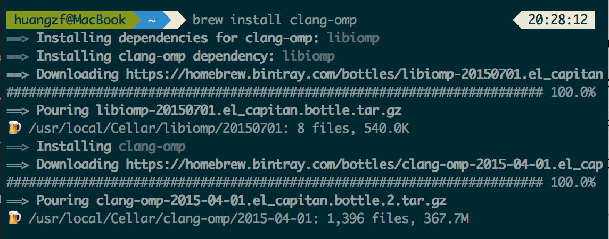
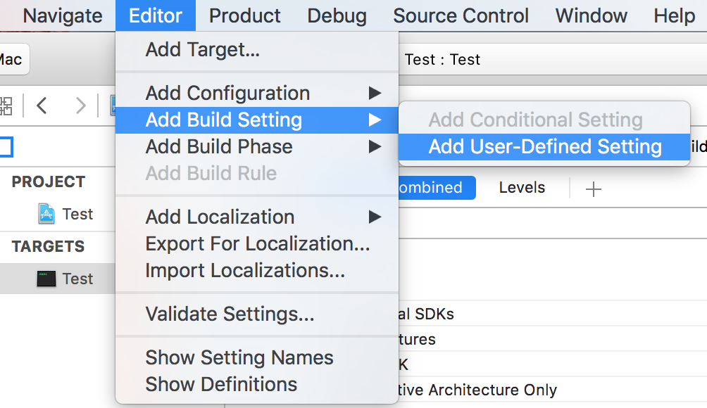
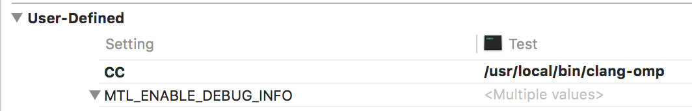
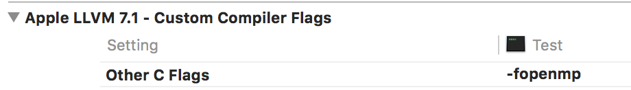
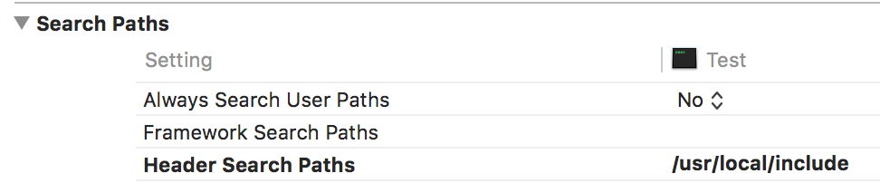
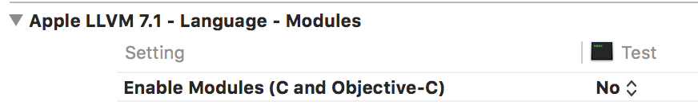

    
## Using clang-omp with Xcode

**Instructions are provided by [Sebastian Stenzel](https://github.com/overheadhunter).**

### Install clang-omp using homebrew: 

		brew install clang-omp

 

---

###Create a new Xcode project. Under Build Settings:
 
* Add a new user-defined setting **CC** with the value `/usr/local/bin/clang-omp`
 
 (a) Turn to Editor-->Add Build Setting-->Add User-Defined Setting.
 
 
 
 (b) Fill `CC` under **Setting** and `/usr/local/bin/clang-omp` as its value.
 
 
 
* Add `-fopenmp` to **Other C Flags**
 
 
 
* Add `/usr/local/include` to **Header Search Paths**
 
 
 
* Set the value of **Enable Modules (C and Objective-C)** as `No`.
 
 

--- 

###Under Build Phases

 Add `/usr/local/lib/libiomp5.dylib` to **Link Binary With Libraries**

Done. You can now `#include <libiomp/omp.h>` and start using `#pragma omp ...` in your source code.

---

Finally, I need to thank Sebastian Stenzel for this blog, and the reference is [https://clang-omp.github.io](https://clang-omp.github.io).




