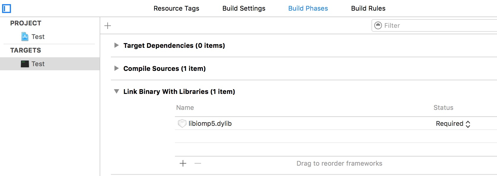
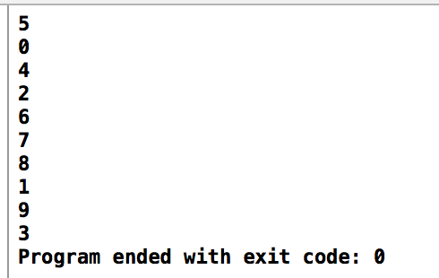

    
## Using clang-omp with Xcode

**Instructions are provided by [Sebastian Stenzel](https://github.com/overheadhunter).**

### Install clang-omp using homebrew: 

	brew install clang-omp

 

---

###Create a new Xcode project. Under Build Settings:
 
* Add a new user-defined setting **CC** with the value `/usr/local/bin/clang-omp`
 
 (a) Turn to Editor-->Add Build Setting-->Add User-Defined Setting.
 
 
 
 (b) Fill `CC` under **Setting** and `/usr/local/bin/clang-omp` as its value.
 
 
 
* Add `-fopenmp` to **Other C Flags**
 
 
 
* Add `/usr/local/include` to **Header Search Paths**
 
 
 
* Set the value of **Enable Modules (C and Objective-C)** as `No`.
 
 

--- 

###Under Build Phases

 Add `/usr/local/lib/libiomp5.dylib` to **Link Binary With Libraries**

 

Done. You can now `#include <libiomp/omp.h>` and start using `#pragma omp ...` in your source code.

Here is an example:

	#include <stdio.h>
	#include <libiomp/omp.h>
	
	int main(int argc, const char * argv[])
	{
	    int i;
	#pragma omp parallel for
	    for (i = 0; i < 10; i++) {
	        printf("%d\n", i);
	    }
	    
	    return 0;
	}

Result:

 
 
 So we successfully implement the parallelization.

###ATTENTION!

Maybe sometimes we need to create a C++ Project, and we will define **CC** as `/usr/local/bin/clang++`, but it will bring another error for xcode 7.3:

	error: can't exec '/usr/local/bin/clang++-omp++' (No such file or directory)

There is an effective way to solve this problem, which is referred to stackoverflow: [click here](http://stackoverflow.com/questions/33668323/clang-omp-in-xcode-under-el-capitan). That is to do this:

	sudo ln -s /usr/local/bin/clang-omp++ /usr/local/bin/clang++-omp

And then we define **CC** as `/usr/local/bin/clang` not `/usr/local/bin/clang++`. 

---

###References:

Finally, I need to thank Sebastian Stenzel for this blog, and the reference is [https://clang-omp.github.io](https://clang-omp.github.io).




