# 给树莓派换个内核
###1. 寻找、下载Linux实验板卡所用的Linux内核源码；

下载链接：
`https://codeload.github.com/raspberrypi/linux/zip/rpi-4.1.y_rebase`

下载`4.1.18-v7`内核版本，得到`linux-rpi-4.1.y_rebase.zip`。

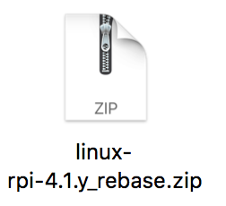

解压时为防止源码文件名因大小写被合并的问题，解压时加上`-C`选项：

	unzip -C linux-rpi-4.1.y_rebase.zip

得到了`linux-rpi-4.1.y_rebase`文件夹，也就是源码的根目录。

---

###2. 在内核中加入新的系统调用，修改内核代码配置，编译内核将编译好的内核装载到板卡启动

**本实验在ubuntu-16.04环境下用交叉编译工具`arm-linux-gnueabihf-gcc`完成。**

首先在源码中添加系统调用，我们选择223号系统调用进行修改。先`cd`进入源码根目录`linux-rpi-4.1.y_rebase`。

* 进入`arch/arm/kernel`目录下，添加自己的`mysyscall.c`文件

		cd arch/arm/kernel
		vi mysyscall.c
 
 加入自己的系统调用`mysuperstar`：

 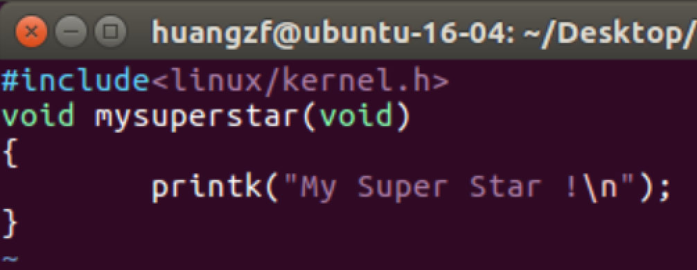
 
 增加系统调用，将内核不使用的 223 号系统调用替换为新的系统调用:

 		vi call.S
 
 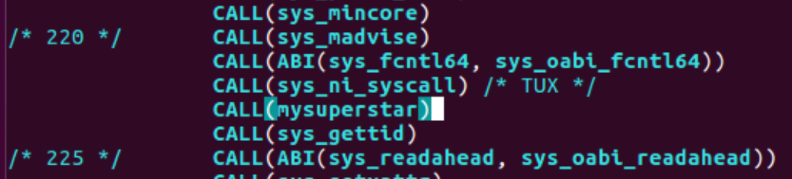
 
 修改 Makefile 文件,增加编译 mysyscall.o:
 
 		vi Makefile
 
 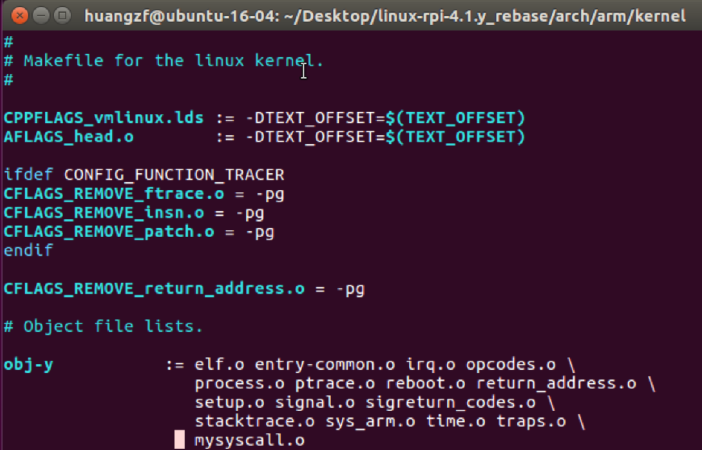
 
* 回到内核源码目录下，配置生成`.config`。首先把`Makefile`的编译器改成自己的版本。修改`ARCH`和`CROSS_COMPILE`的值。
 
 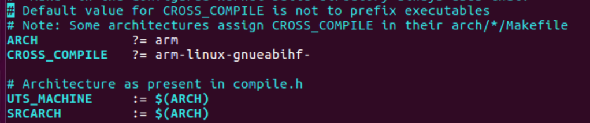
 
 如果ubuntu上`apt get`获取的是`arm-linux-gnueabihf-gcc-4.9`，还要修改下面`CC`那一行的值为`gcc-4.9`。
 
 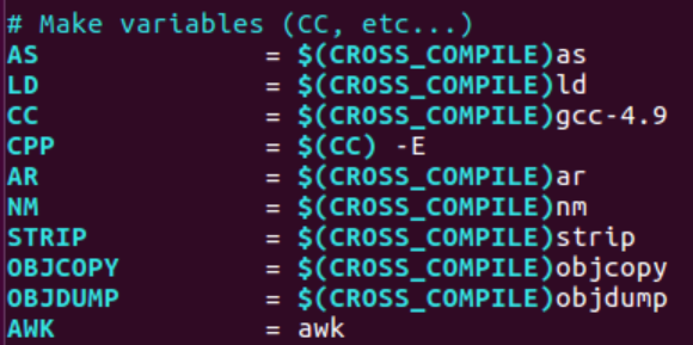
 
 加载`arch/arm/configs/bcm2709_defconfig`生成`.config`文件:
 
 		make bcm2709_defconfig
 
 然后执行`make`编译：
 
 		make -j4 zImage modules dtbs
 		
 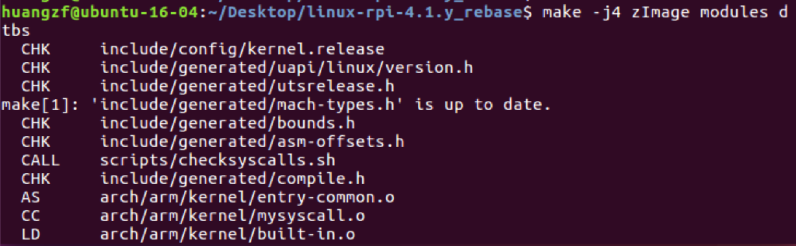
 
 编译完成后结果如下：
 
 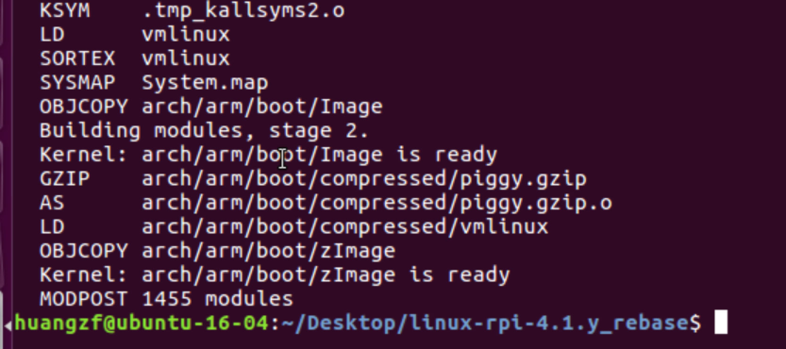
 
* 下一步是将内核装载到树莓派的SD卡上，首先用读卡器将SD卡接到PC上，通过ubuntu访问SD卡。我的SD卡接入后自动挂载到`/media/huangzf/`，其中fat32格式的boot分区挂载在`/media/huangzf/boot`，ext4格式的其余目录挂载在`/media/huangzf/443559ba-b80f-4fb6-99d9-ddbcd6138fbd`下。

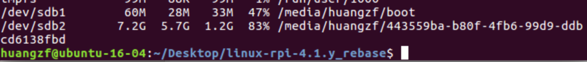

然后将内核模块装载到SD卡的ext4分区下：

	sudo make INSTALL_MOD_PATH=/media/huangzf/443559ba-b80f-4fb6-99d9-ddbcd6138fbd modules_install

将生成的`zImage`文件转化为树莓派启动用的`.img`文件，添加到树莓派`/boot`下：

	sudo scripts/mkknlimg arch/arm/boot/zImage /media/huangzf/boot/kernel_new.img

复制必要的文件到SD卡`/boot`目录下：

	sudo cp arch/arm/boot/dts/*.dtb /media/huangzf/boot
	sudo cp arch/arm/boot/dts/overlays/*.dtb* /media/huangzf/boot/overlays/

进SD卡的`/boot`目录，修改`config.txt`文件，在最后添加一行：

	kernel=kernel_new.img

使树莓派在开机时找`kernel_new.img`。然后拔出SD卡，插到树莓派上启动即可。

* 启动树莓派，ssh连接到树莓派上。编写`main.c`文件，调用223号系统调用：

		#include<stdio.h>
		#include<sys/syscall.h>
		int main()
		{
			syscall(223);
			return 0;
		}

编译运行后，查看log输出:

	dmesg | tail

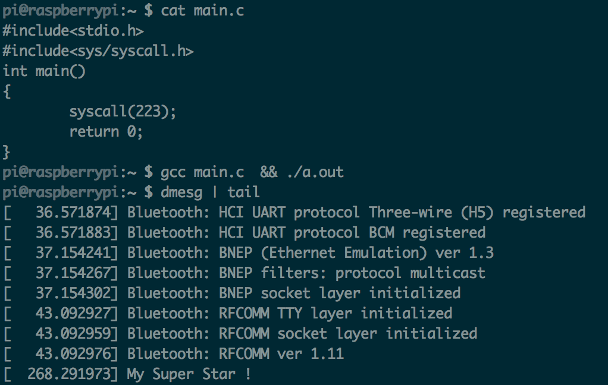

输出了前面内核源码中`mysyscall.c`中的`My Super Star`信息，内核装载和系统调用测试都成功。

---

###3. 编写C代码，用两种方法做系统调用，测试：

* 嵌入汇编代码，用r0传参数；

代码如下：

	#include <stdio.h>
	#include <sys/syscall.h>
	void main()
	{
		__asm(
			"stmfd   sp!, {fp, lr}\n\t"
			"add     fp, sp, #4\n\t"
			"mov     r0, #223\n\t"
			"bl      syscall\n\t"
			"ldmfd   sp!, {fp, pc}\n\t"
		);
	}

将常数223传给r0，然后用bl指令调用`syscall`函数。编译程序后运行，查看log记录，可以发现已经输出了`My Super Star`，说明223号系统调用成功执行。

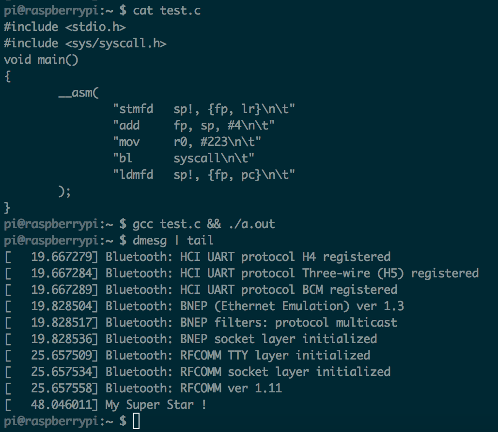

* 用syscall()函数。

 C语言执行系统调用跟前面一样：
 
 		#include<stdio.h>
		#include<sys/syscall.h>
		int main()
		{
			syscall(223);
			return 0;
		}

编译运行后，查看log，第二句`My Super Star`就是C语言调用`syscall`输出来的内容。

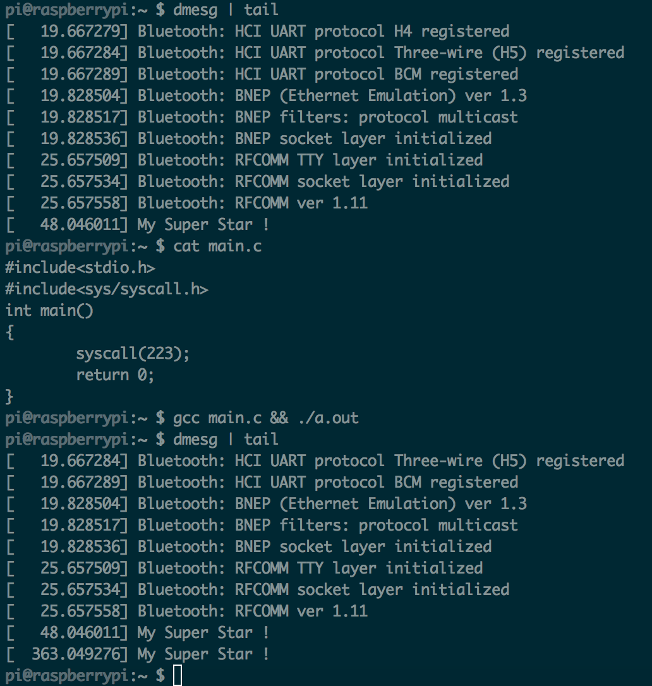

两种方法做系统调用都得以实现。

###4. 编写内核模块，在模块加载和卸载时能通过内核打印函数输出提示信息

这里使用操作系统实验中使用的遍历进程内核模块，采用结构体`task_struct`类型的指针变量`task`，对`task`指针用`init_task`变量赋初值，用`list_for_each`函数以及`list_entry`函数遍历进程，获取每一个进程的`task_struct`结构体指针。该结构体具有成员`state`，表示进程状态。还有`real_parent`，表示指向父进程的指针。分别对进程的十种可能的状态进行`switch-case`判断，可以统计出各种进程的数目。



文件`print_id.c`:
	#include <linux/kernel.h>
	#include <linux/module.h>
	#include <linux/init.h>
	#include <linux/sched.h>
	#include <linux/list.h>

	static __init int print_pid(void)
	{
		struct task_struct *task, *p;
    	struct list_head *pos;
    	int count = 0;
    	int cnt[10] = {0};

    	printk("$begin$\n");
    	task=&init_task;
    	list_for_each(pos, &task->tasks)
    	{
            p = list_entry(pos, struct task_struct, tasks);
            printk("$$ %s %d ", p->comm, p->pid);
            switch(p->state) {
                    case TASK_RUNNING:
                        cnt[0]++;
                        printk("TASK_RUNNING");
                        break;
                    case TASK_INTERRUPTIBLE:
                        cnt[1]++;
                        printk("TASK_INTERRUPTIBLE");
                        break;
                    case TASK_UNINTERRUPTIBLE:
                        cnt[2]++;
                        printk("TASK_UNINTERRUPTIBLE");
                        break;
                    case EXIT_ZOMBIE:
                        cnt[3]++;
                        printk("TASK_ZOMBIE");
                        break;
                    case __TASK_STOPPED:
                        cnt[4]++;
                        break;
                    case __TASK_TRACED:
                        cnt[5]++;
                        break;
                    case EXIT_DEAD:
                        cnt[6]++;
                        break;
                    case TASK_DEAD:
                        cnt[7]++;
                        break;
                    case TASK_WAKEKILL:
                        cnt[8]++;
                        break;
                    case TASK_WAKING:
                        cnt[9]++;
                        break;
                    }

            count++;
            printk(" %s $$\n", p->real_parent->comm);
        }

    	printk("$$ Num Of TASK_RUNNING: %d $$\n", cnt[0]);
    	printk("$$ Num Of TASK_INTERRUPTIBLE: %d $$\n", cnt[1]);
    	printk("$$ Num Of TASK_UNINTERRUPTIBLE: %d $$\n", cnt[2]);
    	printk("$$ Num Of EXIT_ZOMBIE: %d $$\n", cnt[3]);
    	printk("$$ Num Of __TASK_STOPPED: %d $$\n", cnt[4]);
    	printk("$$ Num Of __TASK_TRACED: %d $$\n", cnt[5]);
    	printk("$$ Num Of EXIT_DEAD: %d $$\n", cnt[6]);
    	printk("$$ Num Of TASK_DEAD: %d $$\n", cnt[7]);
    	printk("$$ Num Of TASK_WAKEKILL: %d $$\n", cnt[8]);
    	printk("$$ Num Of TASK_WAKING: %d $$\n", cnt[9]);

    	printk("$$ the number of process is:%d $$\n",count);

    	return 0;
	}

	static __exit void print_exit(void)
	{
    	printk("end of print_id!\n");
	}

	module_init(print_pid);
	module_exit(print_exit);

Makefile内容如下：

	obj-m := print_id.o
	
	KERNEL_VER := 4.1.18-v7
	KERNEL_DIR := linux-rpi-4.1.y_rebase
	
	PWD := $(shell pwd)
	ARGS := ARCH=arm CROSS_COMPILE=arm-linux-gnueabihf-
	all:
	    make -C $(KERNEL_DIR) SUBDIRS=$(PWD) $(ARGS) modules
	clean:
	    rm *.o *.ko *.mod.c
	.PHONY:clean

两个文件都在ubuntu上编写好，然后`make`开始交叉编译内核模块，生成`print_id.ko`，把它拷贝到树莓派的`/home`目录下。

装载内核模块：

	sudo insmod mykernel.ko

lsmod命令查看有没有`mykernel`模块，发现是有的。

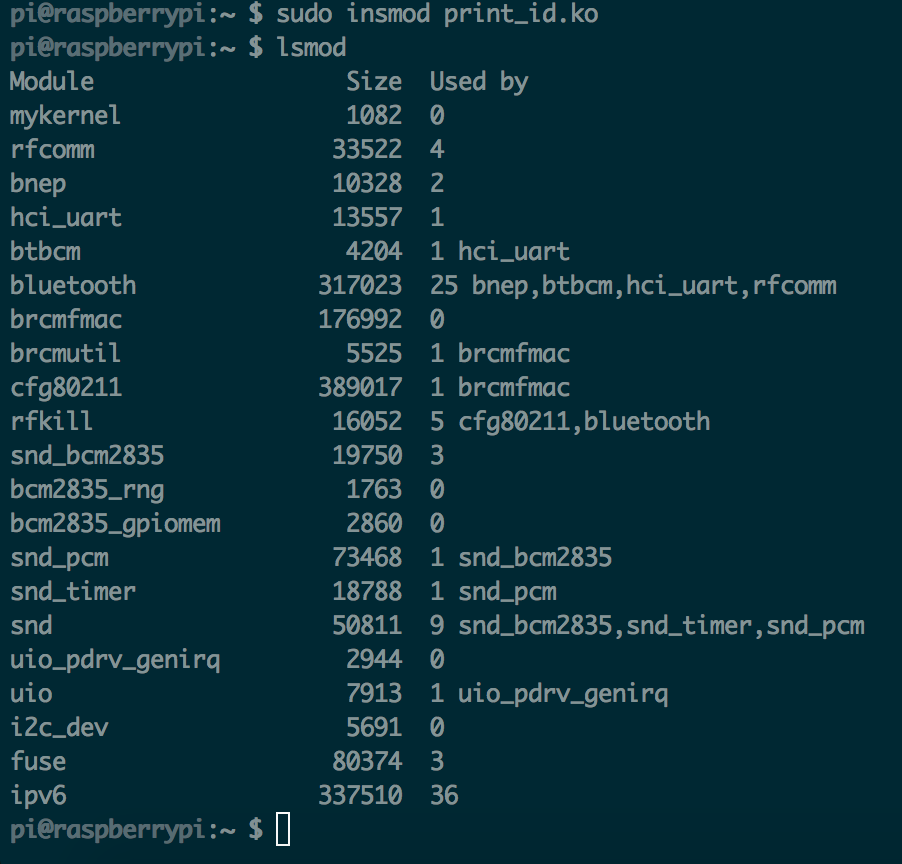

然后查看输出log:

	dmesg

内容如下：输出了各种进程的数量。

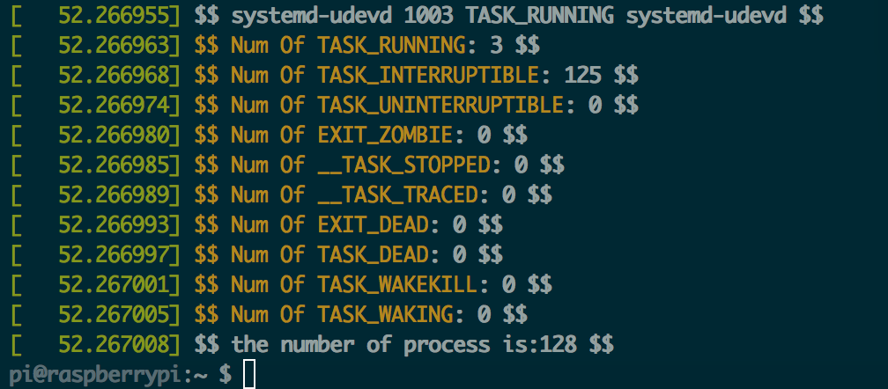

最后卸载`mykernel`模块：

	sudo rmmod mykernel

