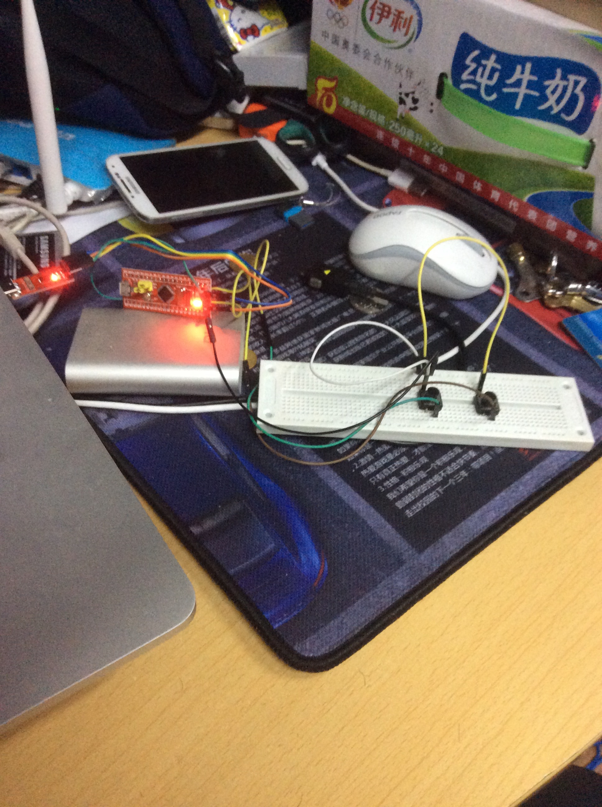
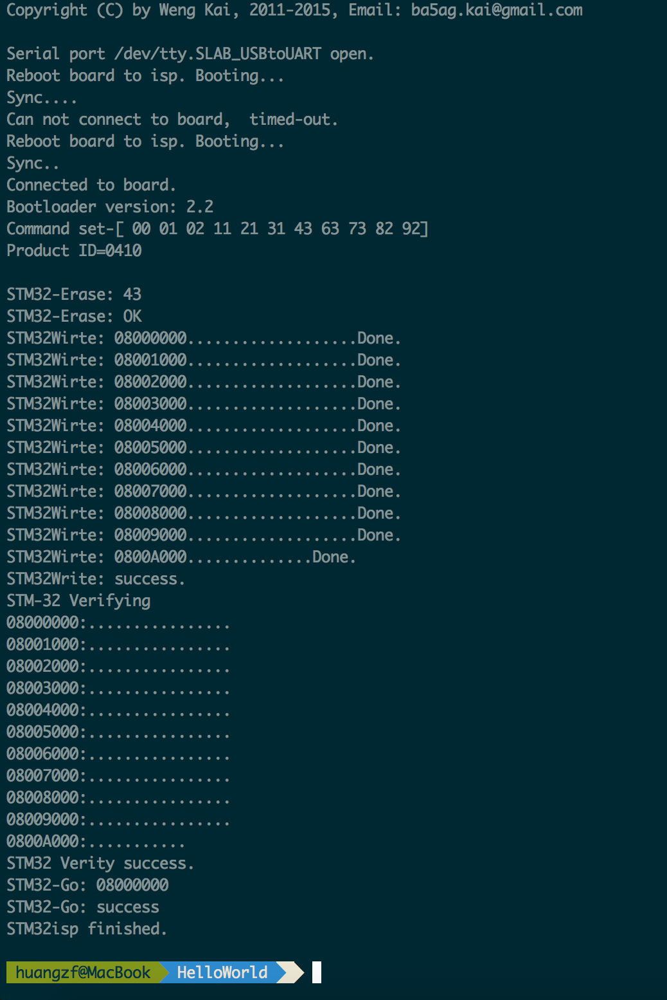
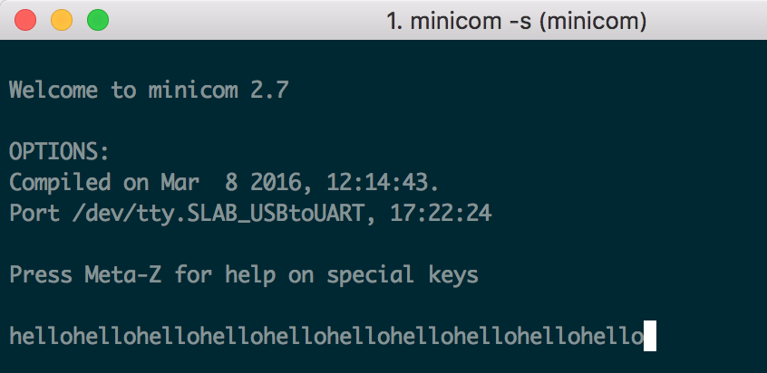
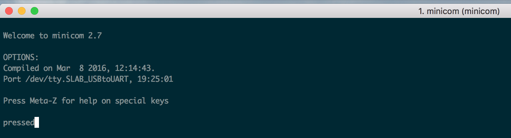
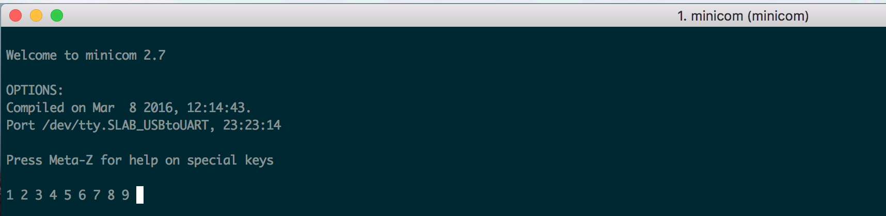
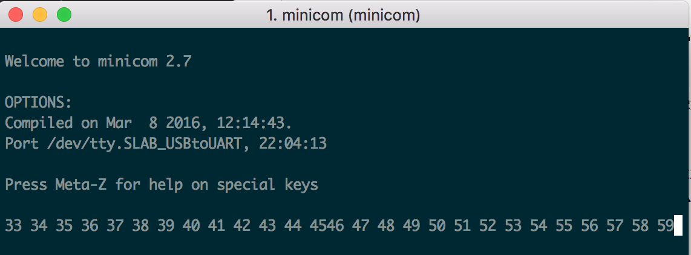
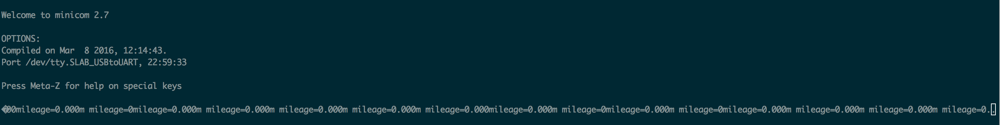
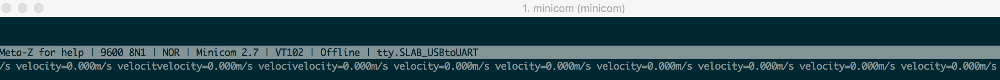
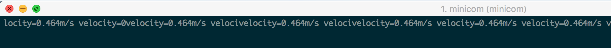
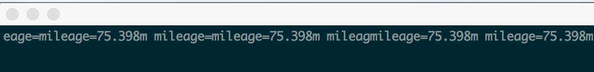

##MacOS上makefile珍稀版stm32运行环境配置

##实验步骤

实验过程连线图：

程序主要框架在附件中，包括makefile。

---

###编写Cube程序，配置UART0为9600,8n1，上电后向串口输出“Hello”，在PC上通过串口软件观察结果；

定义初始化uart函数`MX_USART1_UART_Init`:

	/* USART1 init function */
	void MX_USART1_UART_Init(void)
	{
		huart1.Instance = USART1;
		huart1.Init.BaudRate = 9600;
		huart1.Init.WordLength = UART_WORDLENGTH_8B;
		huart1.Init.StopBits = UART_STOPBITS_1;
		huart1.Init.Parity = UART_PARITY_NONE;
		huart1.Init.Mode = UART_MODE_TX_RX;
		huart1.Init.HwFlowCtl = UART_HWCONTROL_NONE;
		huart1.Init.OverSampling = UART_OVERSAMPLING_16;
		HAL_UART_Init(&huart1);//初始化UART
	}

其中`huart1`是`UART_HandleTypeDef`类型的全局变量。以下为main函数的编写，其中在主循环中调用了`HAL_UART_Transmit`函数发送"hello"字符串内容。

	int main(void)
	{
		HAL_Init();
	
		/* Configure the system clock */
		SystemClock_Config();
			
		/* Initialize all configured peripherals */
		MX_GPIO_Init();
		MX_USART1_UART_Init();
		
		unsigned char *p="hello";
		while (1)
		{
			HAL_UART_Transmit(&huart1, p, 7, 1);
			HAL_Delay(1000);
		}
	  	/* USER CODE END 3 */
	}

在Src目录下的`stm32f1xx_hal_msp.c`文件中，在`HAL_UART_MspInit`函数中激活GPIO和UART的时钟，配置GPIO的引脚，PA9作为TX，PA10作为RX。

	void HAL_UART_MspInit(UART_HandleTypeDef* huart)
	{
		GPIO_InitTypeDef GPIO_InitStruct;
		if(huart->Instance==USART1)
		{
			/* Peripheral clock enable */
			__HAL_RCC_GPIOA_CLK_ENABLE();
			__HAL_RCC_USART1_CLK_ENABLE();
			  
			GPIO_InitStruct.Pin = GPIO_PIN_9;
			GPIO_InitStruct.Mode = GPIO_MODE_AF_PP;
			GPIO_InitStruct.Speed = GPIO_SPEED_HIGH;
			HAL_GPIO_Init(GPIOA, &GPIO_InitStruct);
				
			GPIO_InitStruct.Pin = GPIO_PIN_10;
			GPIO_InitStruct.Mode = GPIO_MODE_INPUT;
			GPIO_InitStruct.Pull = GPIO_NOPULL;
			HAL_GPIO_Init(GPIOA, &GPIO_InitStruct);
		}
	}

然后使用附件中的makefile，执行make命令，生成`blink.hex`文件。接下来我们利用配置好的Mac下的stm32isp工具，将hex文件烧录进stm32板上。执行stm32isp命令:

	stm32isp blink.hex /dev/tty.SLAB_USBtoUART 115200

其中`/dev/tty.SLAB_USBtoUART`是stm32 USB挂载位置，可用`ls /dev/tty.*`命令查看。烧录结果如下：

看到上述输出表示成功，注意在`Sync.`第一次出现时要及时按下stm32板上的reset键。

要查看串口输出的信息，使用minicom工具，我们用`minicom -s`进入设置模式，在Serial port setup中将串口挂载目录设置为`/dev/tty.SLAB_USBtoUART`，波特率设为9600。然后保存，进入minicom可观察到如下信息，即每隔一秒输出一次hello。

---

###通过面包板在PA11和PA12各连接一个按钮开关到地，编写Cube程序，配置PA11和PA12为内部上拉到输入模式，在main()函数循环检测PA11按钮按下，并在按钮按下时在串口输出“Pressed”

连接图见报告的第一张图，配置PA11和PA12的方式为：在`HAL_UART_MspInit`中设置PA11和PA12。

文件`stm32f1xx_hal_msp.c`:

	void HAL_UART_MspInit(UART_HandleTypeDef* huart)
	{
		GPIO_InitTypeDef GPIO_InitStruct;
		GPIO_InitStruct.Pin = GPIO_PIN_11; 
		GPIO_InitStruct.Mode = GPIO_MODE_INPUT; 
		GPIO_InitStruct.Pull = GPIO_PULLUP; 
		GPIO_InitStruct.Speed = GPIO_SPEED_LOW; 
		HAL_GPIO_Init(GPIOA, &GPIO_InitStruct); 
		GPIO_InitStruct.Pin = GPIO_PIN_12; 
		GPIO_InitStruct.Mode = GPIO_MODE_IT_FALLING; 
		GPIO_InitStruct.Pull = GPIO_PULLUP; 
		GPIO_InitStruct.Speed = GPIO_SPEED_LOW; 
		HAL_GPIO_Init(GPIOA, &GPIO_InitStruct);
	}

文件`main.c`中，

* 我们添加了去抖动，方法是在检测到PA11被按下时，执行一个10ms的延时，然后再次检测PA11的电平值，如果此时仍为被按下，则认定此时按键被按下一次。
* 设置标识变量flag，表示按键当前被按下还是被松开，以实现上升沿触发。

		unsigned char *p="pressed";
		int tag = 0;
		while (1)
		{
			if (HAL_GPIO_ReadPin(GPIOA, GPIO_PIN_11) == RESET && tag == 0) {
				HAL_Delay(10);
				if (HAL_GPIO_ReadPin(GPIOA, GPIO_PIN_11) == RESET)
				{
					HAL_UART_Transmit(&huart1, p, 7, 1);
					tag = 1;
				}
			}
			if (HAL_GPIO_ReadPin(GPIOA, GPIO_PIN_11) == SET) {
				tag = 0;
			}
		}

执行make命令编译，以及stm32isp烧录命令，然后minicom查看串口输出结果如下。当按下PA11时，串口输出且仅输出一个pressed，这说明去抖动和按键标识变量都起到了应有的作用。

---

###编写Cube程序，配置PA12下降沿触发中断，程序中设置两个全局变量，一个为计数器，一个为标识。当中断触发时，计数器加1，并设置标识。在主循环中判断标识，如果标识置位则清除标识并通过串口输出计数值

在文件`stm32f1xx_hal_msp.c`中`HAL_UART_MspInit`函数，配置PA12下降沿触发中断，设置中断优先级，enable中断向量表处理:

	GPIO_InitStruct.Pin = GPIO_PIN_12; 
	GPIO_InitStruct.Mode = GPIO_MODE_IT_FALLING; 
	GPIO_InitStruct.Pull = GPIO_PULLUP; 
	GPIO_InitStruct.Speed = GPIO_SPEED_LOW; 
	HAL_GPIO_Init(GPIOA, &GPIO_InitStruct);
	/* USER CODE END USART1_MspInit 1 */
	    
	HAL_NVIC_SetPriority(EXTI15_10_IRQn,0,0); 
	HAL_NVIC_EnableIRQ(EXTI15_10_IRQn); 

文件`stm32f1xx_it.c`中添加`EXTI15_10_IRQHandler`函数，并重写`HAL_GPIO_EXTI_Callback`函数，内部实现count加一和flag置位:

	void HAL_GPIO_EXTI_Callback(uint16_t GPIO_Pin)
	{
	 extern int count;
	 extern int flag;
	 count++; 
	 flag = 1;
	}
	
	void EXTI15_10_IRQHandler()
	{
	  HAL_GPIO_EXTI_IRQHandler(GPIO_PIN_12);
	}

main.c中定义全局变量count和flag，主循环中：

	while (1)
	{
		//HAL_UART_Transmit(&huart1, "pressed", 7, 1);
		if (flag == 1)
		{
			flag = 0;
			char s[10];
			sprintf(s, "%d ", count);
			HAL_UART_Transmit(&huart1, (unsigned char *)s, strlen(s), 1);
		}
	}

结果如下：

###编写Cube程序，开启定时器为200ms中断一次，中断触发时设置标识，主循环根据这个标识来做串口输出(取消4的串口输出)

`main.c`中，添入`HAL_TIM_PeriodElapsedCallback`函数：
	
	TIM_HandleTypeDef TIM_Handle;
	int count = 0;
	int flag = 0;
	
	void HAL_TIM_PeriodElapsedCallback(TIM_HandleTypeDef *htim)
	{
		if (htim->Instance == TIM3)
		{
			flag = 1;
			count++;
		}
	}
	
	int main(void)
	{
	  HAL_Init();
	
	  /* Configure the system clock */
	  SystemClock_Config();
	
	  /* Initialize all configured peripherals */
	  MX_GPIO_Init();
	  MX_USART1_UART_Init();
	  MX_TIM3_Init();
	  /* USER CODE BEGIN 2 */
	  HAL_TIM_Base_Start_IT(&TIM_Handle);
	  /* USER CODE END 2 */
	
	  while (1)
	  {
	  	//HAL_UART_Transmit(&huart1, "pressed", 7, 1);
	  	if (flag == 1)
	  	{
	  		flag = 0;
	  		char s[10];
	  		sprintf(s, "%d ", count);
	  		HAL_UART_Transmit(&huart1, (unsigned char *)s, strlen(s), 1);
	  	}
	  }
	  /* USER CODE END 3 */
	
	}

函数`MX_TIM3_Init`:

	void MX_TIM3_Init(void)
	{
		TIM_ClockConfigTypeDef sClockSourceConfig;
	    TIM_MasterConfigTypeDef sMasterConfig;
	
	    TIM_Handle.Instance = TIM3;
	    TIM_Handle.Init.Prescaler = 8000;
	    TIM_Handle.Init.CounterMode = TIM_COUNTERMODE_UP;
	    TIM_Handle.Init.Period = 199;
	    TIM_Handle.Init.ClockDivision = TIM_CLOCKDIVISION_DIV1;
	    HAL_TIM_Base_Init(&TIM_Handle);
	
	    sClockSourceConfig.ClockSource = TIM_CLOCKSOURCE_INTERNAL;
	    HAL_TIM_ConfigClockSource(&TIM_Handle, &sClockSourceConfig);
	
	    sMasterConfig.MasterOutputTrigger = TIM_TRGO_RESET;
	    sMasterConfig.MasterSlaveMode = TIM_MASTERSLAVEMODE_DISABLE;
	    HAL_TIMEx_MasterConfigSynchronization(&TIM_Handle, &sMasterConfig);
	}

文件`stm32f1xx_hal_msp.c`添入两个函数:

	void HAL_TIM_Base_MspInit(TIM_HandleTypeDef *htim)
	{
	  if (htim->Instance == TIM3)
	  {
	    __TIM3_CLK_ENABLE();
	    HAL_NVIC_SetPriority(TIM3_IRQn, 0, 0);
	    HAL_NVIC_EnableIRQ(TIM3_IRQn);
	  }
	}
	
	void HAL_TIM_Base_MspDeInit(TIM_HandleTypeDef *htim)
	{
	  if (htim->Instance == TIM3) 
	  {
	    __TIM3_CLK_DISABLE();
	    HAL_NVIC_DisableIRQ(TIM3_IRQn);
	  }
	}

文件`stm32f1xx_it.c`中添入一个函数`TIM3_IRQHandler`:

	void TIM3_IRQHandler()
	{
	  HAL_TIM_IRQHandler(&TIM_Handle);
	}

于是完成了和上一个步骤同样的功能，每200ms触发一次中断，count加一，flag置位。结果如下：

###编写完整的码表程序，PA12的按钮表示车轮转了一圈，通过计数器可以得到里程，通过定时器中断得到的时间可以计算出速度；PA11的按钮切换模式，模式一在串口输出里程，模式二在串口输出速度。

首先在main.c文件中，定义车轮半径为0.8m，同时定义几个标识变量代表模式、时间、速度、里程等。

	int count = 0;//车轮转的圈数
	int flag_timer = 0;//for timer
	int flag_btn = 0;//for PA12
	int mode = 0;//切换模式
	float mileage = 0;//里程
	float velocity;//速度
	float ttime = 0;//总时间
	const float RADIUS = 0.8;

按钮11，12分别用part2和part3里面的方式做触发，定时器也是用上面的方式做触发。PA12和timer的callback函数定义如下：

	//Press PA12
	void HAL_GPIO_EXTI_Callback(uint16_t GPIO_Pin)
	{
		flag_btn = 1;
	}
	
	//Timer
	void HAL_TIM_PeriodElapsedCallback(TIM_HandleTypeDef *htim)
	{
		if (htim->Instance == TIM3)
		{
			flag_timer = 1;
		}
	}

main函数中的while循环代码：

	while (1)
	  {
	  	//处理PA11
	  	if (HAL_GPIO_ReadPin(GPIOA, GPIO_PIN_11) == RESET && tag == 0) {
			HAL_Delay(10);
			if (HAL_GPIO_ReadPin(GPIOA, GPIO_PIN_11) == RESET)
			{
				mode = 1 - mode;//切换模式
				tag = 1;
			}
		}
		if (HAL_GPIO_ReadPin(GPIOA, GPIO_PIN_11) == SET) {
			tag = 0;
		}
		
		//根据模式选择输出内容
		if (mode == 0)
		{
			char s[50];
	  		sprintf(s, "mileage=%.3fm ", mileage);//输出里程
	  		HAL_UART_Transmit(&huart1, (unsigned char *)s, strlen(s), 1);
		}
		else
		{
			char s[50];
	  		sprintf(s, "velocity=%.3fm/s ", mileage / ttime);//输出速度
	  		HAL_UART_Transmit(&huart1, (unsigned char *)s, strlen(s), 1);
		}
	
		//Press PA12
	  	if (flag_btn == 1)
	  	{
	  		flag_btn = 0;
	  		count++;//车轮圈数加1
	  		mileage += PI * RADIUS * 2;//里程加一圈的长度
	  	}
	
	  	if (flag_timer == 1)
	  	{
	  		flag_timer = 0;
			ttime += 0.2;//计时器计数
	  	}
	  }

得到输出结果如下：

一开始里程为0

按下PA11切换模式，输出速度为0

按下PA12后，车轮圈数增加，发现输出速度改变

多次按下PA12增加里程，然后切换模式回到模式0，看里程数

由此可见自行车码表的计数功能已经实现。


