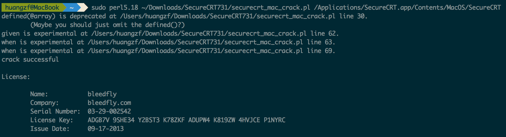
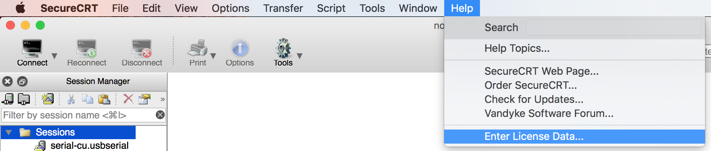
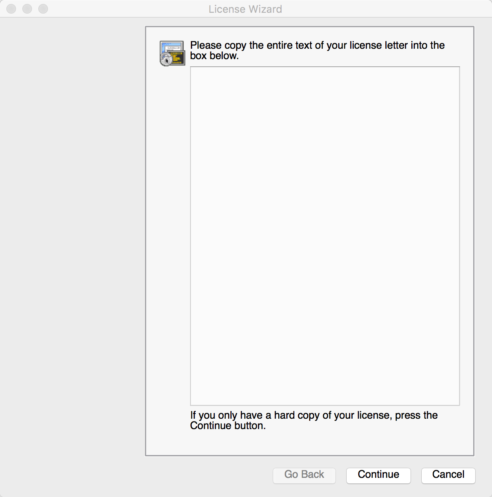
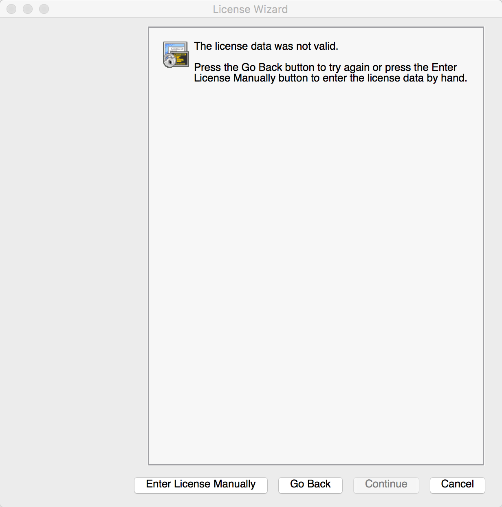
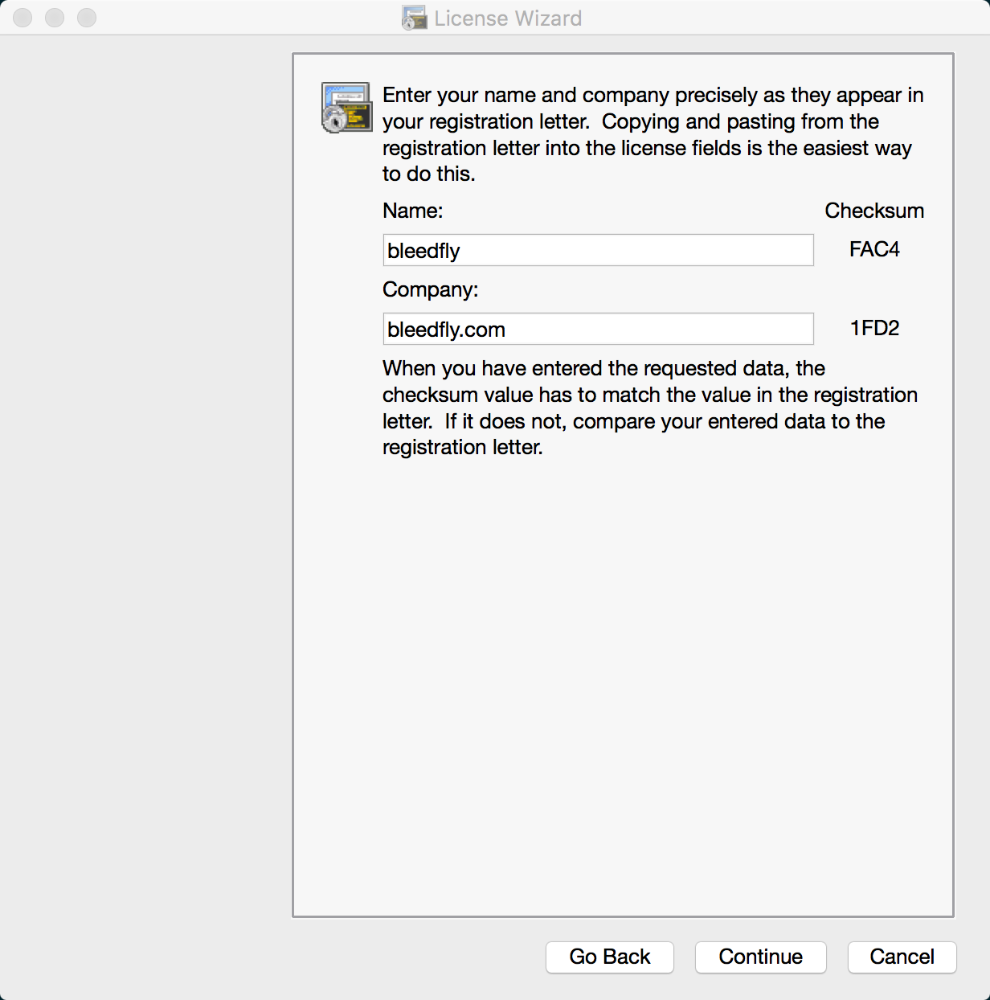
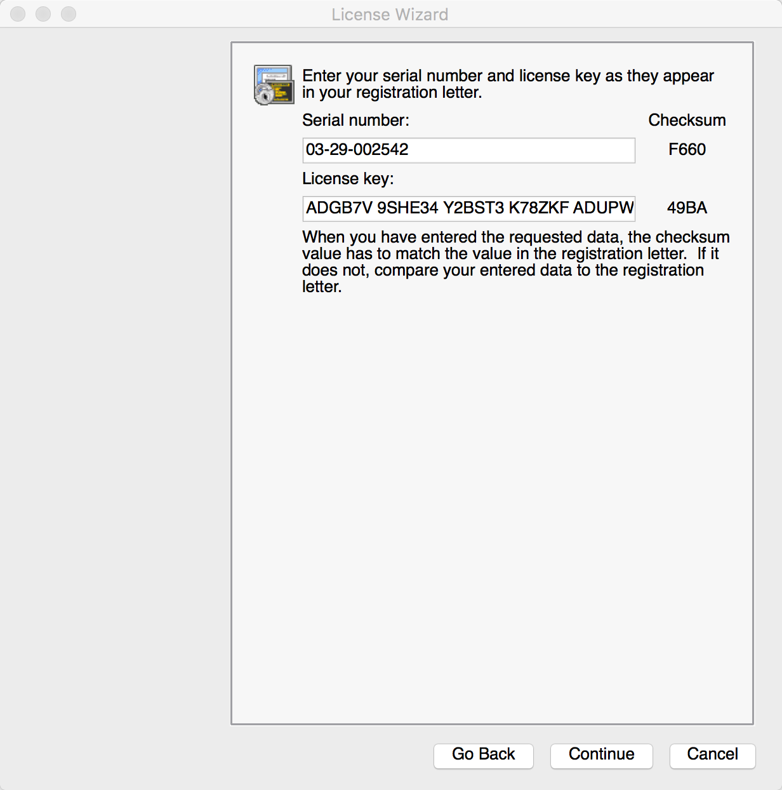
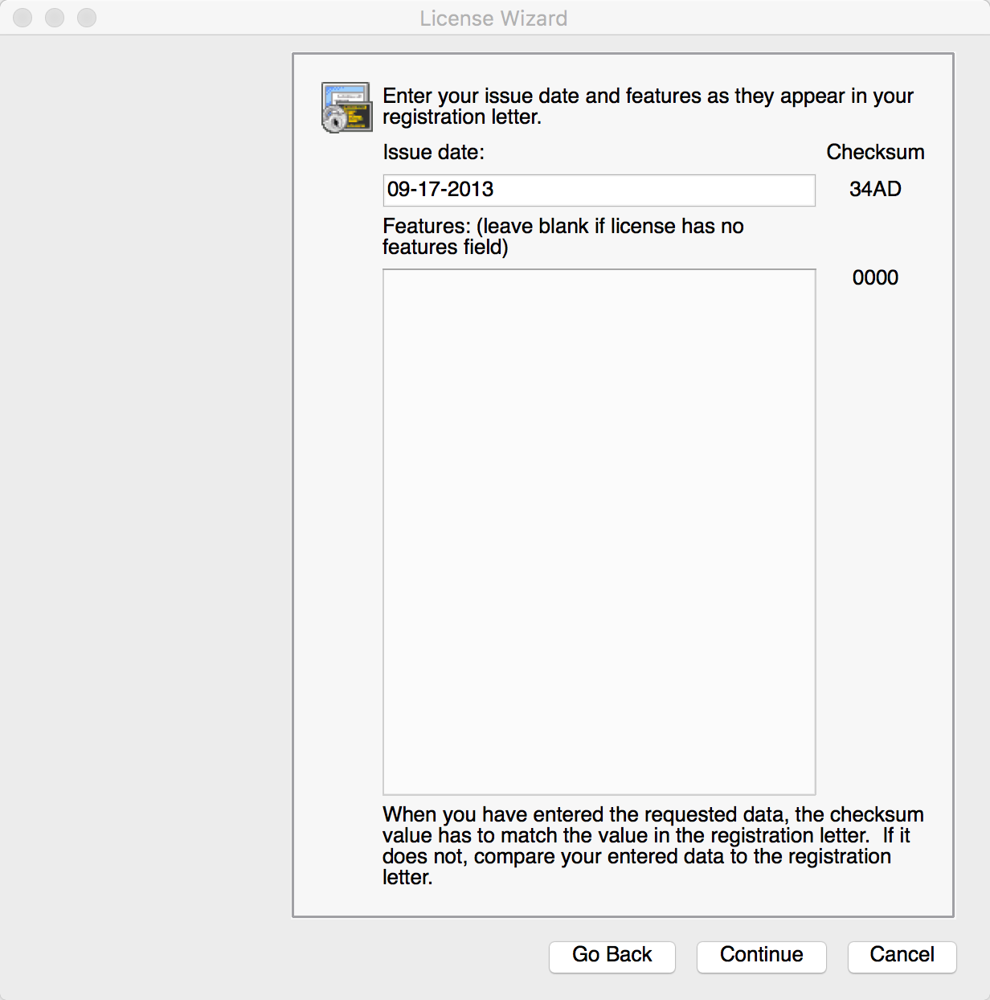
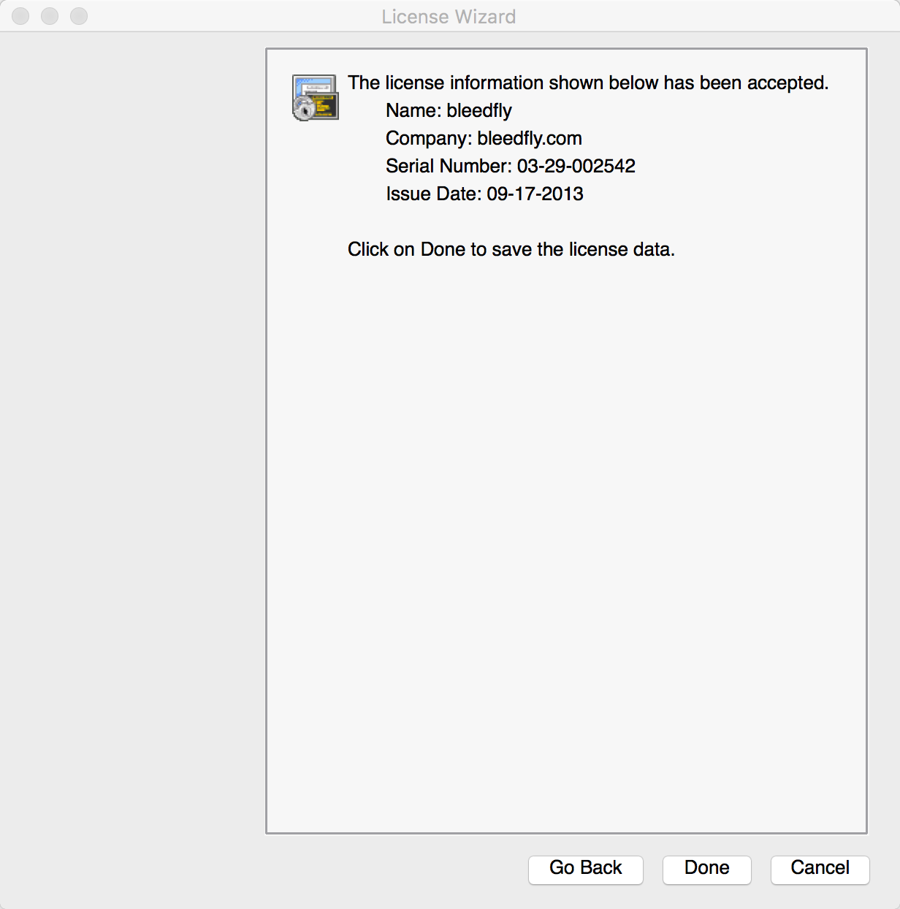
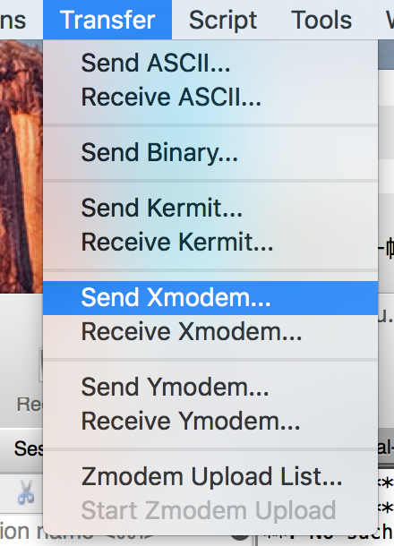

<link rel="stylesheet" type="../text/css" href="../stylesheets/stylesheet.css" media="screen">
    <link rel="stylesheet" type="../text/css" href="../stylesheets/github-dark.css" media="screen">
    
## MacOS Xmodem串口传输文件

在没有路由的情况下，要连接嵌入式板卡传输文件，需要串口通信。本文介绍的就是用Xmodem在Mac和树莓派之间进行串口通信的实例。

1. 首先Mac OS 10.11下需要下载最新版的树莓派驱动，链接

 [PL2303\_For\_MacOS\_10.11](http://www.prolific.com.tw/UserFiles/files/PL2303_MacOSX_1_6_0_20151022.zip)

2. 下载SecureCRT for Mac:

	 [SecureCRT731.zip](http://180.97.83.132:443/down/67333b1d50c608fbf0f0bbedff203f63-17111169/SecureCRT731.zip?cts=f-F54bc6D183A157A160A35&ctp=183A157A160A35&ctt=1459569022&limit=1&spd=430000&ctk=87a9a6d6a9f264a9c62c6bbc5d56cbbe&chk=67333b1d50c608fbf0f0bbedff203f63-17111169
)
	
	解压zip后双击`scrt-7.3.1-685.osx_x64.dmg`，将`SecureCRT`文件拖入/Application目录下。

3. 	现在开始进入SecureCRT的破解教程。

* 首先cd进入`securecrt_mac_crack.pl`所在目录，在终端执行命令：

		sudo perl securecrt_mac_crack.pl /Applications/SecureCRT.app/Contents/MacOS/SecureCRT
	
	**注意：请用`perl -v`命令确保perl的版本是5.18，如果为5.22等其他版本可能报错。**
	
	结果如下，我们便获得了license的破解信息。
	
	 
	
* 运行SecureCRT，点击Help-->Enter License Data...

	 
 
 在License Wizard界面中，忽略之，点continue
 
 
 
 
 
 点击Enter License Manually，然后出现如下界面。按照上面license的信息来填写
 
    
 
 最后激活成功，点击done完成。至此SecureCRT的安装与破解已经全部完成。
 
4.串口连接到Rpi后，在树莓派板上输入`rx filename`命令，使其处于等待接收文件状态。假如要发送的文件是main.c，则输入命令

		rx main.c

PC端打开SecureCRT for Mac，Transfer->Send Xmodem

选择main.c文件，点击OK

然后观察板上terminal，发现文件已成功接收。


